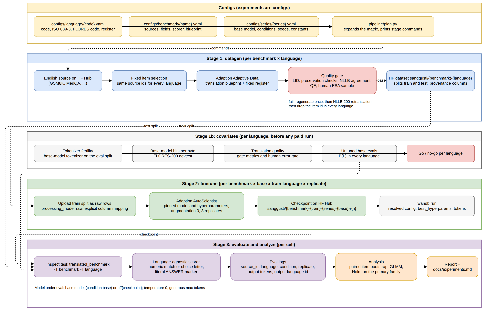
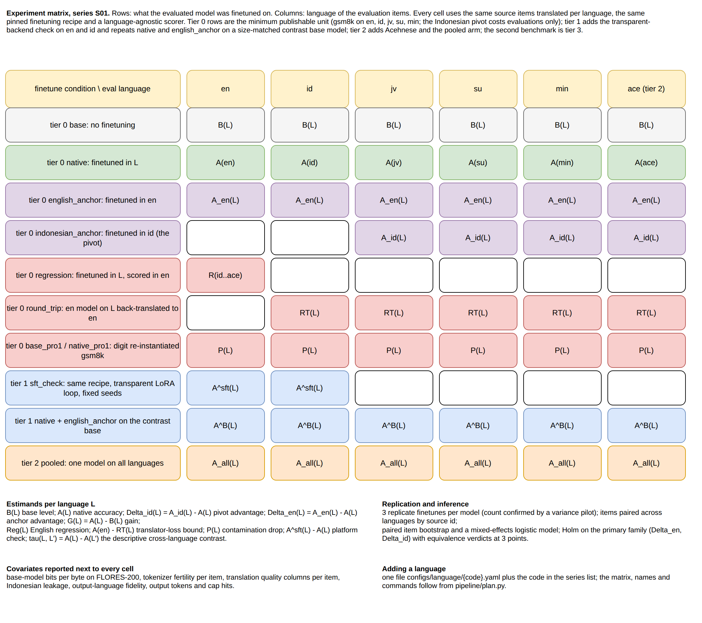
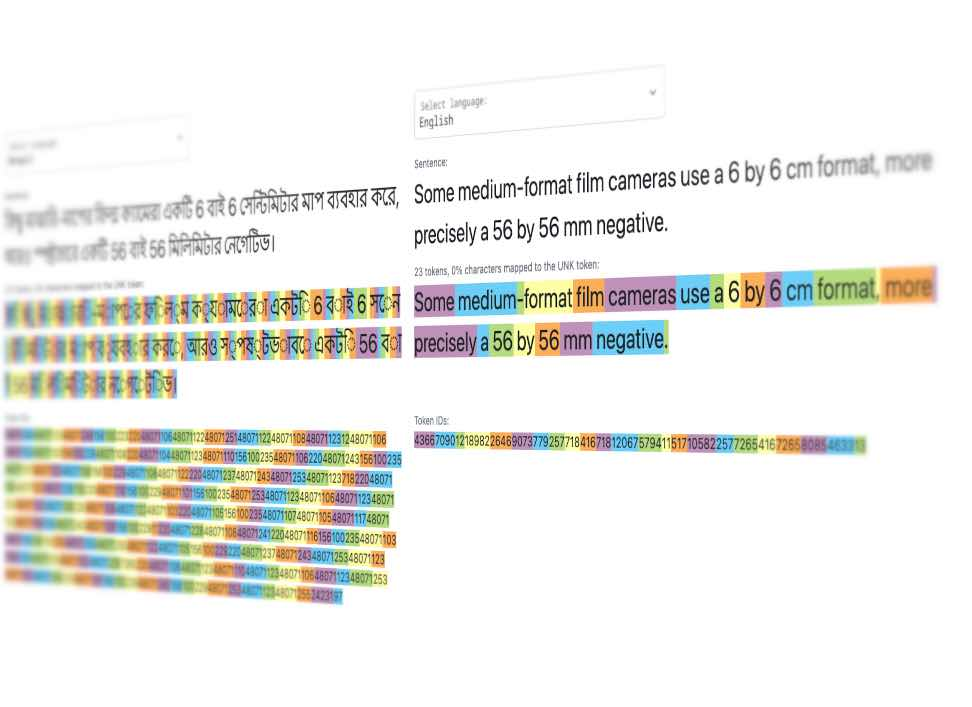
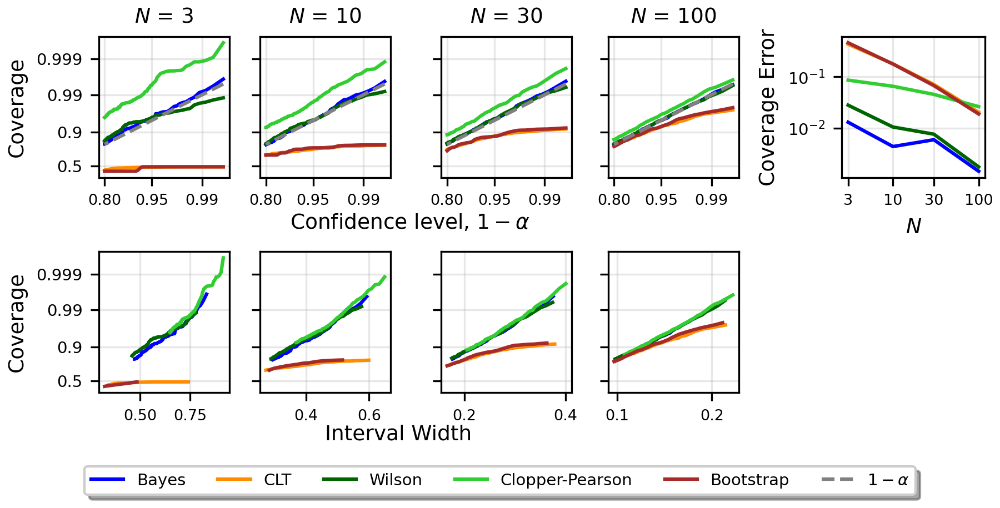
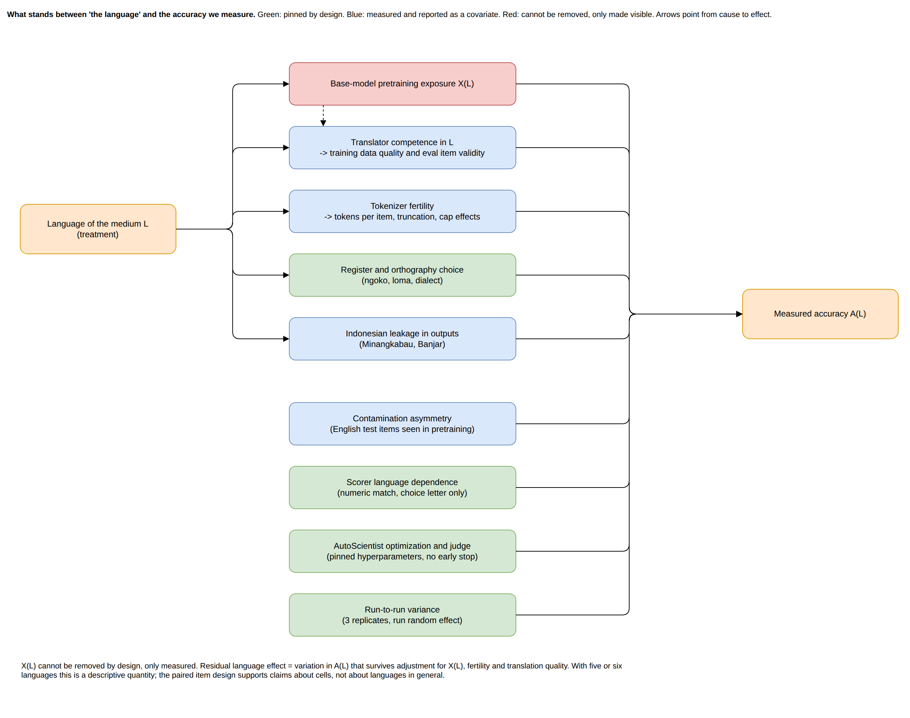

# Methodology: language as the medium of finetuning and evaluation

This document is the pre-registered design for experiment series S01 (`configs/series/s01_language_medium.yaml`). It fixes the question, the estimands, the conditions, the data and translation protocol, the finetuning and evaluation protocols, the analysis plan and the go/no-go rules before any paid run is submitted. Changes after the first run are recorded as amendments in `docs/experiments.md`, never edited in place. The literature that motivates each choice is in [docs/research/5_language_as_medium.md](research/5_language_as_medium.md); the evaluation of the original plan is in [docs/plan_review.md](plan_review.md); the mechanics of running the matrix are in [docs/reproducibility.md](reproducibility.md).

*Figure 1. Stages of the pipeline. Registries define the experiment; the planner derives the matrix; each stage reads its cell from the plan. Editable source: `docs/diagrams/pipeline_flow.drawio`.*

## 1. Research question and estimands

### 1.1 The question

Take one base model, one task dataset in English, one translation procedure, one finetuning recipe, one language-agnostic scorer, and a target language L in which the model will be evaluated. The finetuning data can be translated into L (native), kept in English (English anchor), translated into Indonesian (Indonesian pivot) or pooled across the languages. Which choice gives the best accuracy in L, does the answer change with L, and how much of the cross-language ordering of accuracy is explained by pretraining exposure, translation quality and tokenization?

The four arms are the options a practitioner has, and their contrasts are identified within one language (section 1.4). The Indonesian pivot is the contrast specific to this language family: the regional languages share much of their lexicon with Indonesian, Indonesian has orders of magnitude more pretraining exposure than any of them, and no prior study has asked whether it is a better pivot than English for them. The cross-language question, which language is the best medium, is reported as a descriptive comparison with its covariates attached.

The informal version of the question asks whether some language is a "smarter" medium for an LLM, with English anchoring and reports of token-efficient Chinese reasoning as the motivation, and with the intuition that Indonesian has a small vocabulary and a simple way to express intent. With one language per structural profile that claim is not estimable (E10 below), so the design treats the intuition as a set of measurable quantities reported in a side table rather than as a hypothesis.

### 1.2 Notation

Let M0 be the base model, D = (D_train, D_test) the English source items, T(D, L) the translation of D into L, F(M, D') the finetuning recipe applied to M on D', and E(M, D'') the accuracy of M on D'' under the scorer.

| Symbol | Definition | Name |
|---|---|---|
| B(L) | E(M0, T(D_test, L)) | base level |
| A(L) | E(F(M0, T(D_train, L)), T(D_test, L)) | native accuracy |
| A_en(L) | E(F(M0, D_train), T(D_test, L)) | English anchor |
| A_id(L) | E(F(M0, T(D_train, id)), T(D_test, L)) | Indonesian anchor, regional L only |
| A_all(L) | E(F(M0, pooled training set), T(D_test, L)) | pooled arm |
| RT(L) | E(F(M0, D_train), T_back(T(D_test, L))) | round trip: the L test split back-translated to English by an independent system (NLLB-200), scored with the English finetune |
| P(L) | E(., T(D_test, L)) - E(., T(D_test^pro1, L)) | contamination drop: accuracy on the original minus the digit re-instantiated split, for the base and the native model |
| G(L) | A(L) - B(L) | gain from native tuning |
| Delta_en(L) | A_en(L) - A(L) | anchor advantage |
| Reg(L) | E(F(M0, T(D_train, L)), D_test) - A(en) | English regression after tuning in L, relative to the English finetune; Reg_B(L), relative to B(en), is reported alongside |
| tau(L, L') | A(L) - A(L') | cross-language contrast |

### 1.3 The treatment is a bundle

Choosing L sets five things at once, and with one base model, one translator and one tokenizer they are perfectly collinear across languages:

| Component | Symbol | Set by | Manipulable here |
|---|---|---|---|
| Linguistic structure | S(L) | the language | no |
| Base-model pretraining exposure | X(L) | the base model's corpus | only by changing the base model |
| Translator competence | Q(L) | the translation model | by item-level quality, by a second translator, by human verification |
| Tokenizer fertility | Phi(L) | the base tokenizer | only by changing the base model; varies item to item |
| Surface register | R(L) | the translation blueprint | yes, within a language |

The user's question is about S(L). The literature attributes measured cross-language gaps to X, Q and Phi, and no study has isolated a residual effect of S once those are normalized (literature note, sections 5.2 and 5.3). The design therefore states, for each estimand, which components it can and cannot separate.

### 1.4 Estimands ordered by identification

Identified as causal effects of a manipulable choice, within one language, paired on items and replicated over finetuning runs:

- E1, gain from native tuning: G(L).
- E2, anchor advantages: Delta_en(L), and Delta_id(L) = A_id(L) - A(L) for regional L. Together these form the primary family of 10.3; the pivot-versus-anchor contrast A_id(L) - A_en(L) is derived from them.
- E3, pooling advantage: A_all(L) - A(L).
- E4, English regression: Reg(L).
- E5, register effect within one language: A(jv, krama) - A(jv, ngoko) (optional arm, not active in S01; section 3).

Identified as a paired difference of bundles, descriptive of this base model, translator and tokenizer:

- E6, the cross-language contrast tau(L, L'), and the same contrast on B and A_en. This is the user's question. It is estimable and it is reported, but it is not an effect of S(L).

Identified only up to an invariance argument:

- E7, language by base-model interaction: does the ordering of A(L) change when the base model changes and S(L) does not? Two size-matched base models with different documented exposure are the minimum for any statement that survives the objection "that is just the corpus". The two bases differ in corpus, tokenizer and post-training at once, so a change of ordering shows model specificity; the covariate table says which of those components moves with it.

Partially identified through item-level covariates:

- E8, the residual cross-language contrast after adjusting for item-level translation quality, token count, Indonesian leakage and cap hits. These vary within a language, so their coefficients are identified; what remains still contains X(L) and S(L) together.

Descriptive only:

- E9, any regression of A(L) on language-level covariates. With six languages this is a plot with a fitted line.
- E10, any statement that a language is a "simpler" or "smarter" medium. With one language per structural profile S is not replicated, so it is not estimable. What is reported instead is the measured content of the premise: characters per item, tokens per item, bits per byte, and whether Indonesian behaves as its exposure and fertility predict.

Translation quality and tokenizer fertility are mediators of the bundle effect for the "which medium should I use" question (E6) and nuisance for the "is it the language" question (E7, E8). Both readings are reported and labelled.

## 2. Hypotheses and decision rules

Each hypothesis names its estimand, the test, the predicted direction and the observation that counts against it. Tests use the models of section 10; "interval" means a 95 percent interval from the mixed model, corrected as stated in 10.3. Every primary contrast also receives an equivalence verdict: two one-sided tests against the bound of 3 accuracy points fixed in the series file (`analysis.equivalence_bound_points`), so that a contrast ends as different, equivalent within the bound, or undetermined, and a null is a claim rather than an absence. Trend clauses across languages are descriptive predictions (E9) and are reported as plots, not tested.

Primary, ordered by novelty:

- H1, Indonesian pivot. Estimand: Delta_id(L) = A_id(L) - A(L) for each admitted regional L, and the pivot-versus-anchor contrast A_id(L) - A_en(L). Prediction: Delta_id(L) >= 0, with A_id(L) above A_en(L) for the languages closest to Indonesian (min first). Test: the primary Holm family of 10.3 with the equivalence verdict. Against: A_id(L) below A(L) with an interval excluding zero for any regional L, which means the pivot costs accuracy; or A_id(L) equivalent to A_en(L) for every regional L, which means the pivot offers nothing beyond English anchoring. Either outcome is a usable practitioner result.
- H2, English anchor on reasoning. Estimand: Delta_en(L) for the admitted non-English languages on gsm8k. Prediction: Delta_en(L) >= 0. Test: the primary Holm family of 10.3 with the equivalence verdict. For id, jv and su the expected size (about three points on a strong base, literature note 5.1.3) is inside the equivalence bound, so "equivalent" is the pre-registered most likely outcome for those languages and is reported as a result, not as a failure to detect. Against: a Delta_en(L) interval excluding zero below zero for a regional language on gsm8k. Descriptive clauses: the gap widens with lower exposure; the gap on the second benchmark, once chosen, is smaller than on gsm8k (a benchmark by condition interaction from the mixed model, exploratory).
- H3, pooled beats native. Estimand: A_all(L) - A(L). Prediction: at least zero in every language. Test: exploratory family, BH adjusted, with the equivalence verdict. Against: native above pooled with an interval excluding zero in at least two languages. This replicates a published result (MathOctopus; the equal-budget monolingual against multilingual comparison) in a new language family and is bought last (tier 2).

Identification and bounds:

- H4, translator loss. Estimand: d(L) = A(en) - RT(L), the round-trip bound of 5.5. Prediction: d(L) is positive and, descriptively, increases with lower exposure. Test: the paired interval for d(L) excludes zero for min, and for ace if admitted. Reading: the part of the native gap A(en) - A(L) above d(L) is not attributable to the translator. Against: d(L) near zero for a language whose native gap is large, which points at the model rather than the translator.
- H5, exposure invariance. Estimand: the eval-language by base-model interaction (E7). Prediction: no interaction; the ordering on the contrast base agrees with the primary base. Test: the interaction term in the mixed model (exploratory family), and the sign rule of 10.4 applied to the gaps that qualify. Reading if the prediction fails: the ordering is model-specific, and exposure is one of several components (corpus, tokenizer, post-training) that differ between the bases; the covariate table says which of them moves with the ordering.
- H6, platform independence. Estimand: A^sft(L) - A(L) for L in {en, id} on gsm8k, where A^sft is the native accuracy under the transparent LoRA backend with the same rows and hyperparameters (section 7). Prediction: inside the replicate interval of the managed runs. Test: the two-level bootstrap interval of 10.2 includes zero and the equivalence verdict is "equivalent". Against: a difference with an interval excluding zero, which is reported as a platform finding and moves every managed-backend effect in the report to "conditional on the platform".

Descriptive predictions (E9), reported as plots and rank statistics, never tested:

- D1, exposure ordering: base and native accuracy ordered en >= id > jv, su > min, ace. This is the literature's prediction (IndoMMLU, NusaX, Belebele) and confirming it is not a contribution of the study; it is reported because the covariate plots need it and because a violation would be informative.
- D2, similarity to Indonesian: among the regional languages, G(L) and Delta_id(L) ordered by the lexical-similarity covariate measured in Phase 0 (NusaX identical-token share and chrF++ of each language against its Indonesian parallel; no published figure exists for jv, su or ace, so the ordering is fixed by the measurement before any finetune). The rank correlation is reported; with three or four regional languages it is not a test.
- Premise P, the "Indonesian is simpler" intuition. P-a (measured, falsifiable by measurement): under each candidate tokenizer, standard written Indonesian costs more tokens per item than English on the same items; the expected ratio is about 1.2 to 1.6. P-b (descriptive): after the exposure plots of 10.6, Indonesian sits where its exposure and fertility predict. Neither clause supports or refutes a claim about the medium; both are reported in the premise table.

## 3. Factors, conditions and the matrix

*Figure 2. The S01 matrix. Rows are finetuning conditions, columns are evaluation languages, cells name the estimand they feed. Editable source: `docs/diagrams/language_medium_design.drawio`.*

| Factor | Levels | Role |
|---|---|---|
| Evaluation language | en, id, jv, su, min (tier 0); ace (tier 2, after the gate and the floor rule); extensible through `configs/language/` | primary |
| Condition | base, native, english_anchor, indonesian_anchor, regression, round_trip, base_pro1, native_pro1 (tier 0); sft_check, native_contrast, english_anchor_contrast (tier 1); pooled (tier 2) | see 1.4 |
| Benchmark | gsm8k (math, tier 0); the second benchmark is parked at tier 3 until the Phase 2 decision, with medqa as the registry placeholder; extensible through `configs/benchmark/` | task-type replication |
| Base model | primary; contrast (tier 1, gsm8k only) | E7 |
| Training backend | autoscientist (the managed loop, every finetuned condition); sft (a transparent LoRA loop with fixed seeds, tier 1, en and id on gsm8k) | H6 |
| Replicate | 3 independent finetuning runs per finetuned cell (count confirmed or revised by the Phase 4 rule of 10.5) | run-to-run variance |

Tiers are closed under the estimands they claim, so a program that stops after any tier still yields a complete result:

| Tier | What it adds | Estimands | Finetunes | Evals |
|---|---|---|---|---|
| 0 | gsm8k on en, id, jv, su, min: base, native, english_anchor, indonesian_anchor, regression, round_trip, base_pro1, native_pro1 | E1, E2 (Delta_en and Delta_id), E4, E6, the round-trip bound, the contamination drop | 15 | 85 |
| 1 | sft_check (en and id on the transparent backend); native and english_anchor on the contrast base, gsm8k | H6; E7 | 21 | 33 |
| 2 | ace in every tier 0 and tier 1 condition, after the gate and the floor rule; pooled on gsm8k | E3; the lowest-exposure language | 9 | 44 |
| 3 | the second benchmark in every condition (medqa is the placeholder until Phase 2 decides) | task-type replication | 21 | 99 |

Counts come from `uv run python -m pipeline.plan` with 6 languages, 2 benchmarks and 3 replicates; the full series is 30 datasets, 66 finetunes and 261 evaluation runs. Tier 0 is the minimum publishable unit, and the Indonesian pivot sits in it because the Indonesian native model already exists there: the pivot costs evaluations only. A cell's tier is the maximum of its condition tier, its benchmark tier and the tiers of its evaluation and training languages (series `tiers` block), so parking a language or a benchmark never edits a condition.

Optional identification arms, defined but not active in S01 (each is a new language entry or condition, activated by a series amendment): jv_krama (register variant of Javanese, E5); nllb evaluation splits (second translator on the test split); a question-only arm that trains on the L question with the English rationale; a full-finetuning pair on en and jv to bound the LoRA interaction (section 12); the full off-diagonal transfer matrix.

## 4. Materials

### 4.1 Base models

Only models in `client.autoscientist.list_models()` can be finetuned; the live list is authoritative and is copied into `docs/experiments.md` at Phase 0. Selection rule for the primary base, applied in this order: (a) point-estimate accuracy of the untuned model on the 250-item Phase 2 subsets at least 30 percent on gsm8k-id and at least 15 percent on gsm8k-min, the lowest-exposure tier 0 language (the thresholds are the series constants `analysis.floor`), a screening rule rather than a test since the Wilson half-width at n = 250 is about 5.7 points at 30 percent and 4.5 at 15 percent; (b) English base accuracy on the same subsets below 80 percent (`analysis.ceiling`), so that English cells have headroom below the ceiling; (c) documented Indonesian in the pretraining languages; (d) the smallest size that clears (a), because floor is the largest threat in section 12 and size is the cheapest lever against it; if no size within budget clears the Minangkabau floor, the largest affordable size is chosen and min is recorded as expected floor-limited; (e) among ties, the lowest regional-language fertility. Selection rule for the contrast base: same size class and instruct status, support for the pinned training type, and the largest documented difference in exposure to id, jv, su, min and ace.

Provisional choices given the documented catalogue: primary `google/gemma-3-4b-it` (4T pretraining tokens, explicit multilingual rebalancing, a 262k-entry tokenizer described by its authors as more balanced for non-English languages); contrast `meta-llama/Llama-3.2-3B-Instruct` (eight officially supported languages, none Indonesian). `Qwen/Qwen3.5-0.8B` is the only listed model whose vendor names Javanese, Sundanese, Minangkabau, Balinese and Banjar, which makes it useful as a third base for the vendor-flag covariate, but it is a different size class and is expected to sit near floor on regional-language math; it is not one of the two identification bases. If a Qwen3 instruct model between 4B and 12B appears on the live list it is a candidate for primary on the vendor-flag ground; the floor rule decides, and the contrast base moves with the primary's size class or E7 is dropped with a stated reason. If only one base model is available, E7 is dropped and the report states that exposure and language are not separable in this study.

### 4.2 Languages

| Code | Language | Family | Exposure tier | Register fixed in the blueprint | In FLORES-200 | XLM-R covered |
|---|---|---|---|---|---|---|
| en | English | Indo-European | reference | source | eng_Latn | yes |
| id | Indonesian | Malayic | medium | standard written | ind_Latn | yes |
| jv | Javanese | own branch of Malayo-Polynesian | low | ngoko | jav_Latn | yes |
| su | Sundanese | Malayo-Sumbawan | low | loma | sun_Latn | yes |
| min | Minangkabau | Malayic | very low | Agam-Tanah Datar standard (Koto and Koto, 2020) | min_Latn | no |
| ace | Acehnese | Chamic | very low | standard Latin orthography with diacritics | ace_Latn | no |

Registers are pinned because Javanese and Sundanese speech levels change the lexicon itself and language models are biased toward particular tiers; a translator left free will pick one silently and may mix tiers within an item. Each language entry carries a `register_instruction` sentence that is substituted into every translation blueprint (section 5.2), and Phase 0 audits whether the FLORES-200 references for jv, min and ace use the same register and orthography as the pin, so that the calibration in section 6 does not penalize a language for a register mismatch. Minangkabau shares about 75 percent of its lexicon with Indonesian, so a Minangkabau translation that is really lightly modified Indonesian is a specific failure mode with its own gate check (section 6). Later languages (Balinese, Banjar, Buginese, Madurese) enter through one registry file each; Madurese is not in FLORES-200 (its `flores_code` is null) and calibrates on NusaX instead.

### 4.3 Benchmarks

| Registry name | Domain | Train source | Test source | Scorer | Answer protocol |
|---|---|---|---|---|---|
| gsm8k | math | GSM8K train, fixed 1,000-item subset | GSM8K test, 1,319 items; the 250 MGSM items tagged as a subset | numeric match on the last number, scored twice (strict and locale-tolerant, see section 8) | reasoning in L, then `Answer: <integer>` |
| medqa | medical | MedQA USMLE train, fixed 1,000-item subset | MedQA test, 1,273 items | choice letter | `ANSWER: <letter>` |

The original plan named MGSM as the math benchmark. MGSM's value elsewhere is its human translation into ten languages, none of which is a language of this study, so for these languages MGSM offers only 250 items that would have to be machine-translated anyway. At 250 paired items the minimum detectable paired difference is about 8 accuracy points (section 10.5); the full GSM8K test gives about 3.4 at the item level. The eval split is therefore the full GSM8K test with the MGSM items tagged so that the 250-item subset can be reported for comparability with published MGSM numbers.

MedQA was the original second benchmark and remains the registry placeholder for it, parked at tier 3 through the series `tiers` block. The second review (plan_review.md, section 5) found it weak for this study: a thousand rows of letter answers teach the answer format rather than medical knowledge, a 4B base sits near chance in the regional languages, and the borrowing policy keeps medical terms in Indonesian or Latin so the medium is barely varied. Phase 2 decides the second benchmark against the criteria of docs/benchmarks.md section 4, using an English-only finetuning probe that costs no translation; the decision is an amendment recorded in docs/experiments.md, not an edit here.

Both scorers are language-agnostic, but each imposes a protocol: the choice scorer requires the literal `ANSWER:` marker (a translated marker such as `JAWABAN:` returns nothing), and Inspect's numeric scorer parses `1.500` as 1.5 and `2,5` as 25. Translated items and instructions therefore keep English number formatting, which the gate checks. Because an untuned base model may still answer in the Indonesian convention, and scoring that wrong would depress B(L) and inflate G(L) for a formatting reason correlated with the treatment, numeric benchmarks are scored twice: with the strict scorer and with a locale-tolerant scorer that rewrites `1.500` to 1500 against integer targets and `2,5` to 2.5 against fractional targets before matching (`numeric_match_locale` in the task). The locale-tolerant score is primary; the strict score is reported for comparability with published numbers. New benchmarks enter through `configs/benchmark/{name}.yaml`; the rule is that the scorer must be language-agnostic (numeric match, choice letter, code execution). [docs/benchmarks.md](benchmarks.md) lists which standard Inspect tasks qualify.

## 5. Data protocol

### 5.1 Item alignment and splits

Every language version of a split contains exactly the same source items, identified by a stable `source_id`, so comparisons are paired at the item level. The training split is a fixed, seeded 1,000-item subset of the English training source, identical across languages (Adaption requires at least 1,000 rows). The test split is the full English test source. Structural fields (numbers, the `####` delimiter, option order, the index of the correct option, drug names, units, code) are never translated and are verified byte-identical after translation.

### 5.2 Translation route and pinned settings

Translation uses Adaption Adaptive Data. The dedicated `language_expansion` route validates ISO 639-1 codes at request time, and Minangkabau and Acehnese have only ISO 639-3 codes, so the route is probed once with `estimate=True` for all six codes; unless all are accepted, the blueprint route (a fixed system prompt, as `mgsm_convert.py` does) is used for every language. The blueprint is the benchmark's template with two substitutions: `{language}` (the English name from the language registry) and `{register_instruction}` (the register sentence from the language registry). Whichever route is chosen is the same for all languages. Pinned for every run: the recipe toggles `prompt_rephrase`, `deduplication` and `reasoning_traces` set explicitly to false; `brand_controls.length` fixed; `hallucination_mitigation` false (web grounding would inject language-dependent knowledge); `safety_categories` empty (filtering removes rows at rates that could differ by language); `job_specification.max_rows` and an `idempotency_key` per (benchmark, language, split). Row survival must equal the input count in every language; a language that loses rows is re-run, not trimmed.

### 5.3 Canonical schema

Every published row carries: `id` (equal to `source_id`), `question`, `choices` (multiple choice only), `target`, `instruction` (the translated instruction template, identical on every row), `instruction_en` (the English template, for the English-reasoning eval variant), `question_en`, `answer_en`, `language`, `register`, `blueprint_hash`, `translator_version`, and the quality columns of section 5.4. The Inspect task in `src/evals/tasks/translated_benchmark.py` reads the first seven of these; the analysis joins the rest by id.

### 5.4 Per-item quality columns

| Column | How computed | Used for |
|---|---|---|
| struct_ok | numbers, delimiter, option count and correct index unchanged; numerals in English format; `ANSWER:` marker present in the instruction | hard gate |
| langid_top, langid_prob | GlotLID label and confidence on the translated text with preserved fields stripped, restricted to the study languages plus Indonesian, Malay and English; per sentence only for sentences above a length floor with fewer than half numeric or symbol tokens | hard gate; leak detection |
| leak_id | share of content tokens identical to the Indonesian translation of the same item, excluding numerals, preserved fields, proper nouns and the allowed technical-term list | Indonesian leakage covariate (E8) |
| borrowed_term_share | share of tokens on the allowed technical-term list (medical terms kept in Indonesian or Latin) | terminology covariate |
| register_pred | honorific-level classifier or judge label for jv and su | register gate; E5 |
| qe_bt_nllb_chrf | chrF++ of an NLLB-200 back-translation to English against the English source | item-level translation quality, coverage-safe for every language |
| qe_bt_nllb_comet | reference-based COMET-22 or MetricX score of the same back-translation against the English source | item-level translation quality, coverage-safe |
| qe_chrf_nllb | chrF++ agreement between the Adaption translation and an NLLB-200 translation of the same item | second-opinion covariate |
| qe_cometkiwi, qe_metricx | CometKiwi and MetricX-24 quality estimation; diagnostic in every language (the encoders do not cover min and ace), never a gate | diagnostic |
| solvable_bt | a strong English model solves the NLLB back-translation of the digit re-instantiated item (gsm8k) or picks the gold option on the back-translated item with shuffled options (medqa); re-instantiation prevents the solver from recognizing a memorized item | answerability |
| n_tok_primary, n_tok_contrast | tokens of the item text under each base tokenizer | fertility per item (E8) |
| human_verified, esa_score, answer_preserved | true on the fixed verified subset; error-span annotation score and a binary "answer still correct and unique" verdict from two native annotators | clean-subset analysis |

Back-translations use NLLB-200 (3.3B), an independent system, in every column. A same-translator back-translation cannot be trusted as a quality signal: an LLM that produced Indonesian-leaked Minangkabau back-translates its own output cleanly, and a translator that has memorized the English source can reconstruct it from a poor translation.

### 5.5 Derived evaluation splits

- `-rt`: the L test split back-translated to English by NLLB-200, published as English text with the same ids. RT(L) is evaluated with the English finetunes, which never see L. Because the back pass adds loss of its own and cannot repair the forward translation, d(L) = A(en) - RT(L) overstates forward loss: translation accounts for at most d(L) points of the native gap, and the part of A(en) - A(L) above d(L) is not attributable to the translator. A same-translator round trip may be published as an additional diagnostic but is not the bound.
- `-nllb`: the test split translated by NLLB-200, the strongest freely available system covering all six languages. Used as a second opinion on the eval split and, if activated, as a robustness evaluation.
- `-pro1` (gsm8k only): digit re-instantiation. Numeric literals in the English source are perturbed, the answer recomputed, and the same literals substituted into every translation. English GSM8K is almost certainly in every candidate's pretraining corpus and the translations are not. The base and native models are evaluated on both splits (conditions base_pro1 and native_pro1); the contamination estimand is the difference-in-differences [A(en) - A^pro1(en)] - [A(L) - A^pro1(L)], and its interval comes from the two-level bootstrap of 10.2. This is the one contamination control that keeps the item pairing intact.

### 5.6 Publication and data statement

Datasets are published as `sanggusti/{benchmark}-{language}` with `train` and `test` splits; derived splits use the suffixes above; the pooled training set is `sanggusti/{benchmark}-all`. The dataset card lists the gate results, the calibration numbers, the blueprint, the register, the excluded item ids, the translator (Adaption Adaptive Data, with the run ids and the date, since the underlying model is not disclosed by the platform) and the license of the source. Translated MedQA and GSM8K carry their source licenses; NLLB outputs are CC-BY-NC. Medical datasets and the models finetuned on them carry a clinical-use disclaimer: they are evaluation and research artifacts, not medical advice, and were produced by machine translation of exam items. Every published test split embeds a canary string so that future contamination of these items can be detected, and the card asks downstream users not to train on the test splits. Annotators are named or credited as they prefer, paid at a stated rate, and consent to the use of their annotations; the annotation guideline is published with the data.

## 6. Translation quality gate

Translation quality is correlated with the treatment (worse translations in lower-exposure languages), so it must be measured and reported per language, not only gated. The gate runs in six steps (0 to 5) per (benchmark, language, split); thresholds are set here, before any run. The gate is built so that the same signals decide admission in every language: learned quality-estimation metrics whose encoders do not cover min and ace are diagnostics everywhere and gates nowhere, and the accommodation that admission would otherwise need for the lowest-exposure languages is replaced by a cap on how many rows may be replaced by the fallback translator.

Step 0, calibration, once per language before any benchmark translation. Translate the full FLORES-200 devtest (1,012 sentences; about 5,000 rows across five languages) with the exact route and blueprint the benchmarks will use, and with NLLB-200 3.3B. Audit the references first: run the register classifier over the jav_Latn references and an orthography and diacritic audit over min_Latn and ace_Latn; if the references differ from the pin, change the pin or calibrate on NusaX for that language, and compute chrF++ both raw and diacritic-stripped for Acehnese. Score chrF++ against the human references; the Adaption number is the reported translator quality for L. Compute the quality-estimation metrics on the references, the NLLB outputs and deliberately corrupted references (shuffled sentences, Indonesian substituted for L, altered numbers) and report their AUROC per corruption type as a diagnostic. Calibrate the GlotLID threshold so that at least 95 percent of references pass, and calibrate the per-sentence rule of step 1 on the min references. Measure the identical-content-token share between the NusaX Indonesian and Minangkabau parallel sentences, and the same for every regional language, which gives both the leakage threshold and the lexical-similarity covariate of H3.

Step 1, hard checks on 100 percent of rows (any failure blocks the row): `struct_ok`; GlotLID label equals L with probability above the calibrated threshold, evaluated per qualifying sentence (length floor, fewer than half numeric or symbol tokens, preserved fields stripped) on items with at least three qualifying sentences and on the whole item otherwise, rejecting items labelled Indonesian, Malay or English or with more than 20 percent non-target qualifying sentences; length ratio inside the calibrated band; no refusal or meta text; chrF++ between output and English source below 0.9 (otherwise the row is untranslated). Rejections are reported per language by cause.

Step 2, soft signals on 100 percent of rows, combined into a per-row risk rank from coverage-safe signals only: chrF++ agreement with NLLB-200, the NLLB back-translation scored against the English source, `solvable_bt`, the language-identification confidence and `leak_id`. CometKiwi and MetricX-24 are recorded as diagnostics in every language.

Step 3, an LLM error-span judge on the bottom risk decile plus a 10 percent random sample, with the English source present and few-shot examples in L. The judge triages and explains; it never accepts a row on its own, because multilingual judges overestimate quality in low-resource languages.

Step 4, human review with error-span annotation: 150 items per (benchmark, language) for test splits, drawn as the 50 highest-risk rows plus 100 uniformly random rows whose ids are shared across languages; two native annotators; the agreement statistic is reported. Training splits get 100 random rows plus the bottom 5 percent by risk. The medqa guideline states the borrowing policy: a medical term with no established equivalent in L is kept in Indonesian or Latin and is not an error.

Step 5, admission and fallback. A language is admitted to a series when all of the following hold: chrF++ against the FLORES reference is at least 0.9 times NLLB-200's chrF++ on the same sentences, tested with a paired sentence-level bootstrap, and at least 30 absolute; chrF++ against the language's own FLORES reference exceeds chrF++ against the Indonesian reference (the leakage rule, applied to every language); the GlotLID share of target-language qualifying sentences is at least 0.90 in every language; structure is preserved on 100 percent of rows; register consistency is at least 0.90 for jv and su; among the 100 random human-reviewed rows there is no answer-changed item (95 percent upper bound on the rate 3.0 percent) and at most three major-or-critical errors (upper bound 7.6 percent); and at most 5 percent of rows were replaced by the fallback translator. A row failing a hard check is regenerated once with the failure reason appended to the blueprint, then retranslated with NLLB-200, then excluded from every language so the parallel set stays aligned. A language failing the dataset-level rule is post-edited, or switched to NLLB-200 plus post-editing, or pivoted through Indonesian (measured on FLORES first), or deferred with its scores recorded. Reviewers may be unavailable for min and ace; those languages are then admitted provisionally, flagged in the card, scheduled last in their tier, and reported in a separate column.

## 7. Finetuning protocol

AutoScientist is a managed loop with server-side data optimization, hyperparameter adjustment and early stopping judged by an evaluator whose language behaviour is undocumented. Left free, it would optimize each language differently and the ceteris paribus assumption would fail. Every run in S01 therefore uses:

- `model` pinned to the base id returned by `recommend_hyperparams`; never omitted.
- `max_iterations = 1`. The assumption is that one iteration means one training cycle with no server-side data optimization; it is not verifiable from the SDK and is checked in Phase 4 (`iterations_completed` equal to 1, `best_hyperparams` equal to the submission, row count unchanged). `target_win_rate = 1.0`, the maximum the type allows; with one iteration early stopping cannot change the recipe. Series S02 (three iterations) records `iterations_completed` and treats a run that stopped early as a deviation.
- `augmentation_domain_rows = 0` and `augmentation_general_rows = 0`: synthetic rows would be generated in a language chosen by the platform.
- `hyperparams` passed with every field (the SDK exposes fifteen), copied from one `recommend_hyperparams` call on the English gsm8k dataset of the primary base and recorded in the series file with the dataset id and date; identical across languages within a base model. `training_type = lora`; `train_on_inputs = true`, so that the translated prompt text enters the gradient (with completion-only loss on MedQA the medium would barely be learned, since the completion is a letter). Every S01 effect is therefore an effect under LoRA at the pinned rank; the optional full-finetuning pair bounds that conditionality (section 12).
- `data_format = instruction`, explicit `column_mapping`.
- The training split uploaded with `processing_mode = raw` so the run trains on exactly the published rows.
- Equal rows (1,000) in every language as the primary budget rule, because the platform derives hyperparameters from row count; tokens per run are logged and reported. A token-matched arm is a secondary question, not a correction.
- After every run, `best_hyperparams` is compared with the submitted values and the run is rejected if they differ.
- A replicate is a fresh run with identical arguments and a new `idempotency_key`; the SDK exposes no seed. Three replicates per finetuned cell is the default; the rule of 10.5 confirms or revises the count after the tier 0 gsm8k runs.
- Every run logs the resolved configuration, dataset id, row count, `best_win_rate` (as a covariate only), tokens, and the configuration commit hash to wandb.

The method is supervised finetuning on translated instruction data. The repository's earlier preference-pair construction (chosen = translated answer, rejected = English answer) teaches output-language preference rather than the task and is not used in S01. Preference optimization is series S03. The adaptive AutoScientist loop (`max_iterations = 3`, `target_win_rate = 1.0`) is series S02, run on the tier 0 cells to ask whether the platform's optimizer changes the language ranking.

Platform independence (condition sft_check, tier 1). The managed loop is the treatment in every other finetuned condition, and the first reviewer question is whether its results are platform artifacts. The `sft` backend trains the en and id gsm8k cells again with a plain LoRA loop on Modal (`pipeline/training/sft_finetune.py`): the same published rows, the same hyperparameters copied field by field from the pinned recommendation, loss on inputs, and a fixed seed per replicate (`sft.seeds`), the one control the managed loop cannot offer. Models from this backend carry the `-sft` slug from `naming.backend_slugs`. The reading rule is H6: the transparent cells must fall inside the replicate interval of the managed cells; a deviation is reported as a platform finding and moves every managed-backend effect to "conditional on the platform". The same backend hosts the optional full-finetuning pair of section 12 if it is activated.

## 8. Evaluation protocol

- One Inspect task, `translated_benchmark`, evaluates every cell. The planner passes `-T benchmark`, `-T language`, the resolved `-T dataset_repo` from the series naming, and `-T variant` for derived splits; the task records benchmark, language, variant and dataset in the log metadata. The solver and scorer follow the benchmark registry: `generate` with the two numeric scorers for gsm8k, `multiple_choice` with the choice scorer for medqa.
- Every model, base or finetuned, is evaluated through the same provider (the series `naming.model_provider`, `hf` by default; vLLM on Modal for throughput), so B(L) and A(L) run on the same harness.
- The instruction template is translated once per language, reviewed by a human, and stored on every row; the `ANSWER:` marker and English number formatting are kept in every language.
- Primary metric: accuracy under the locale-tolerant numeric scorer for gsm8k and the choice scorer for medqa, over all responses as scored. The strict numeric score, and accuracy excluding responses produced in the wrong language, are sensitivity analyses.
- Decoding: temperature 0, `max_tokens` 2,048, one epoch. Output tokens per response and cap hits are logged, and accuracy at a 1,024-token cap is derived from the same logs, because tight caps swing cross-language gaps by tens of points.
- Per-sample metadata: `source_id`, `language`, `condition`, `train_language`, `base`, `replicate`, `variant`, plus the quality columns joined by id in the analysis. The analysis reads Inspect logs and never re-derives these.
- Output-language fidelity: GlotLID on every response; Indonesian leakage of the response for regional languages.
- English regression: every finetuned model is scored on the English test split.
- English-reasoning variant (gsm8k, optional tier 2 eval): the English instruction on the translated question, on base, native and anchor models, to separate the language of evaluation from the language of reasoning.
- No LLM judge in primary metrics. Judge-based metrics may appear as secondary metrics with a fixed judge bound through `--model-role grader` and fetched with `required=True`, so that an unbound role raises instead of grading with the model under test.
- Finetuned checkpoints are served once per model, all cells of that model run against that server, and every cell runs a 20-item smoke first.

## 9. Covariates

Per language and base model, measured in Phase 0 and Phase 2 and reported next to every result: bits per byte of the base model on FLORES-200 devtest (tokenizer-independent, paired with a held-out slice of the project's own items in case FLORES is in pretraining); tokens per source word under the base tokenizer; corpus-side counts (MADLAD-400 clean characters, HPLT words) and the vendor language-list flag; the lexical-similarity covariate against Indonesian from NusaX parallel text; zero-shot Belebele accuracy of each candidate base on the id, jv and su splits (900 items each, no translation, an externally comparable exposure probe); the translator's FLORES chrF++; the gate pass rates and human error rates. Per item: the quality columns of section 5.4 and the token counts. Per response: output tokens, cap hit, output-language label, Indonesian leakage.

*Figure 3. The same sentence tokenized in English and Bengali; the non-English version is split into many more tokens. Fertility is measured per item in this study rather than assumed. Source: Petrov et al., 2023, arXiv:2305.15425, repository assets.*

## 10. Analysis plan

### 10.1 Per cell

Accuracy with a 95 percent interval from the item bootstrap, computed in the analysis code from the exported per-sample scores (Inspect's clustered standard error over `source_id` reduces to the plain standard error at one epoch and is kept for multi-epoch runs). Wilson intervals are used for any subset below a few hundred items. Interval overlap is never used to compare cells.

### 10.2 Primary model

Per benchmark, an item-level logistic mixed model on the exported per-sample scores:

logit P(correct_i,l,r = 1) = alpha + beta_language + gamma_condition + (beta gamma)_language x condition + u_i + v_i,l + w_r

with u_i an item random intercept (the same items appear in every language and condition), v_i,l an item-by-language random intercept that absorbs the translation difficulty of that item in that language (dropped only on non-convergence, logged as an amendment; the within-language contrasts E1 to E4 are unaffected by it), and w_r a run random intercept over finetuning runs r = (train language, base, replicate). Contrasts of the fixed effects give E1 to E4 per language and tau(L, L') for every language pair. Per pair of cells the assumption-light check is a two-level bootstrap (B = 10,000): resample runs within each cell, then items, and recompute the difference of cell means; McNemar's exact test on the discordant counts is reported only for single-run comparisons (the base cells).

### 10.3 Families and corrections

Primary family, Holm at alpha 0.05 two-sided, one family per benchmark: Delta_en(L) for every admitted non-English language and Delta_id(L) for every admitted regional language (seven contrasts with the tier 0 languages, nine once ace is admitted), each with the equivalence verdict of 10.5. Everything else (the pivot-versus-anchor contrast A_id(L) - A_en(L), the 15 pairwise language contrasts per condition, G, Reg, the pooling advantage, the platform-independence contrast, the round-trip bounds, the contamination difference-in-differences, the omnibus likelihood-ratio test of the language by condition interaction, and the base-model interaction) is reported with Benjamini-Hochberg adjusted values and labelled exploratory.

### 10.4 Identification analyses

- E7: add base model and its interactions to the model; report the eval-language by base-model interaction. The sign rule applies only to gaps tau(L, L') whose Holm-adjusted interval excludes zero on the primary base and whose languages are above floor on both bases; the pre-registered reading is "exposure-consistent" if every qualifying gap keeps its sign on the contrast base, "model-specific" otherwise; if fewer than three gaps qualify, the outcome is "not testable at this precision". If a rank statistic is reported, agreement means Kendall tau at least 0.733 over the six languages (at most two discordant pairs of fifteen).
- E8: add the item-level covariates (`qe_bt_nllb_chrf`, `n_tok`, `leak_id`, cap hit) as fixed effects; report the language contrasts before and after adjustment and the share of each gap absorbed.
- Round-trip bound: d(L) = A(en) - RT(L) per language with a two-level bootstrap interval, plotted against the native gap A(en) - A(L).
- Contamination: the difference-in-differences of 5.5 with its two-level bootstrap interval, for every language against English.
- Clean subset: the primary contrasts repeated on the human-verified subset; the difference between the full-set and subset estimates over the shared rows gets its own item-bootstrap interval, and a result is labelled translation-limited only if that interval excludes zero. The subset checks bias in the estimates, not the ordering.

### 10.5 Power and the noise budget

For a paired comparison of two single-run cells on n items with discordance rate q, the minimum detectable difference at 80 percent power and alpha 0.05 is about 2.8 x sqrt(q / n):

| n | q = 0.15 | q = 0.20 | q = 0.30 |
|---|---|---|---|
| 250 (MGSM subset) | 6.9 points | 7.9 | 9.7 |
| 1,273 (MedQA test) | 3.0 | 3.5 | 4.3 |
| 1,319 (GSM8K test) | 3.0 | 3.4 | 4.2 |

Comparing two independent accuracies instead of paired items raises the detectable difference to 12.5 points at n = 250 and p = 0.5, against 7.9 paired. The discordance rate is measured in Phase 4 and the table re-computed.

Run-to-run variance is the binding constraint. With k replicates per cell and a between-replicate standard deviation s_r of the cell mean, the standard error of a contrast between two finetuned cells is sqrt(2 s_r^2 / k + q / n), and the run term dominates once s_r exceeds about 1.5 points at k = 3. The combined minimum detectable difference at n = 1,319 and q = 0.2:

| s_r | k = 1 | k = 3 | k = 5 | k = 8 |
|---|---|---|---|---|
| 1.0 | 5.1 | 4.1 | 3.9 | 3.7 |
| 1.5 | 6.7 | 4.8 | 4.3 | 4.0 |
| 2.0 | 8.5 | 5.7 | 4.9 | 4.4 |
| 2.5 | 10.4 | 6.7 | 5.6 | 4.9 |
| 3.5 | 14.2 | 8.8 | 7.1 | 6.0 |

The item-level 3.4 points is the noise floor, not the detectable difference. The replicate policy is a target rule with a pre-registered target of 5 points for the primary family: k is the smallest integer with k >= 2 s_r^2 / ((0.05 / 2.8)^2 - q / n), which gives k = 3 for s_r <= 1.5, k = 5 for s_r <= 2.0 and k = 8 for s_r <= 2.5. s_r is estimated once from the pooled tier 0 gsm8k runs (five languages times three replicates, 10 degrees of freedom) with its interval; when the interval straddles a band the larger k is chosen. If s_r exceeds 2.5 with pinned hyperparameters and one iteration, the platform is not deterministic enough for a 5-point target and the program pauses until that is resolved or the target is amended.

Equivalence. Each primary contrast is also tested with two one-sided tests against the bound of 3 points (`analysis.equivalence_bound_points`), on the same two-level bootstrap: "equivalent" if the 90 percent interval lies inside the bound, "different" if the 95 percent interval excludes zero, "undetermined" otherwise. An equivalence verdict at a true effect of zero needs a standard error below about 1.8 points, which the replicate table gives at k = 3 for s_r at most 1.6, at k = 5 for s_r at most 2.1 and at k = 8 for s_r at most 2.7; these bands are close to those of the 5-point rule, so the replicate rule stands and the equivalence power is reported next to it.

*Figure 4. Normal-approximation and bootstrap intervals fall well below nominal coverage at small n, while Wilson and Bayesian intervals track the target. Per-cell intervals in this study use the item bootstrap at n above 1,000 and Wilson intervals for any subset analysis below a few hundred items. Source: Bowyer et al., 2025, arXiv:2503.01747, Section 3.1 experiment.*

### 10.6 Descriptive layer

One figure per benchmark: A(L), B(L) and A_en(L) against exposure, two ways (bits per byte, and corpus counts), with fertility and translation quality as marker size and colour. Six points, no p-values. The premise table reports, per language: characters per item, bytes per item, tokens per item under each tokenizer, bits per byte, and whether id sits where exposure and fertility predict (premise P of section 2).

### 10.7 Pre-registration record

The following are fixed by this document and the series file, and the commit hash is recorded in `docs/experiments.md` before the first paid run: the hypotheses and their decision rules (section 2); the primary and exploratory families and corrections; the mixed model, the two-level bootstrap and the E7 reading rule as the primary tests; item counts and both power tables; the replicate rule and its 5-point target; the AutoScientist constants; the equal-rows budget rule; the gate thresholds, the fallback cap and the exclusion rule (an item excluded in one language is excluded in all); the primary metric and the sensitivity analyses; decoding settings; the base-model selection rules; the go/no-go rules of section 11.

## 11. Phases, cost order and go/no-go rules

Every phase writes its numbers and its spend to `docs/experiments.md` before the next phase starts. The order buys the novel contrasts first (the pivot and the anchor on gsm8k), the identification checks second, and the confirmatory arms and the second benchmark last.

Phase 0, free measurements. Record the live model catalogue and the per-run cost of each candidate size. Compute fertility, characters and bytes per item, and bits per byte per language for each candidate base on FLORES-200 devtest (on Lightning or Modal; the sandbox cannot reach the Hub). Measure the NusaX identical-content-token share and chrF++ of every regional language against Indonesian (leakage threshold and the D2 covariate). Audit the register and orthography of the FLORES references for jv, min and ace. Output: the covariate table and the premise numbers; a candidate shortlist. No go/no-go.

Phase 1, translation gate calibration and probes (about 5,300 Adaption rows). Probe `language_expansion` with `estimate=True`. Translate the full FLORES-200 devtest per language (about 5,000 rows) with NLLB-200 calibration on Modal. 50-row gsm8k probe per language (250 rows) with the full column set and a human spot check where a reader exists. Go per language on the rules of section 6. Program go: at least en, id and two regional languages admitted; otherwise revise the blueprint or route and repeat. Acehnese is gated here like every language but stays at tier 2 whatever the outcome.

Phase 2, base evals, model size and the second benchmark (about 1,250 Adaption rows plus GPU hours). Translate a fixed 250-item gsm8k test subset per admitted language (the MGSM-tagged items), gated as test splits. Run the untuned candidate bases on them and on Belebele id, jv and su; apply the selection rules of 4.1, floor on id and min, ceiling on en, size as the lever; pin the primary and contrast bases in the series file by amendment. Run the English-only finetuning probe for each second-benchmark candidate (criteria in docs/benchmarks.md section 4) and record the decision as an amendment; medqa stays parked until then. Go: at least one base clears the floor on id and min; otherwise choose the largest affordable size and record min as floor-limited. This phase is publishable on its own as a benchmark-release note with covariates.

Phase 3, full gsm8k translation for the tier 0 languages, test split first under the stricter gate, then train split; derived `-rt` (NLLB-200 back-translation) and `-pro1` splits; human-verified subsets for id, jv and su. Full-split base evals for the primary base on the original and `-pro1` splits become the base and base_pro1 cells. Go per language: the full-split gate matches the probe within the paired bootstrap interval and structure is 100 percent.

Phase 4, tier 0 finetunes on gsm8k: five languages times three replicates (15 runs). Submit en first (also the plumbing smoke: artifact download, Hub push, serving, Inspect on the artifact), then id, then the regional languages in gate-score order; after the en run, check `iterations_completed`, `best_hyperparams` and the row count against the submission and go only on match. Evaluate native, english_anchor, indonesian_anchor, regression, round_trip and native_pro1 cells. Estimate s_r from the 15 runs and apply the replicate rule of 10.5; extra replicates, if required, are bought before anything else. Tier 0 on gsm8k is the minimum publishable unit and answers H1 and H2.

Phase 5, tier 1 identification: the sft_check cells (en and id, six runs on Modal) and the contrast-base native and anchor cells on gsm8k (15 runs). Go for the contrast base: at least one tau(L, L') on the primary base has a BH-adjusted interval excluding zero, and the ordering is stable across replicates (Kendall tau at least 0.733 between replicate orderings); if no language contrast is resolvable, the study reports that with this pipeline the medium does not matter beyond noise, which is a result, and the contrast base is not bought. The sft_check cells are bought regardless, because H6 conditions every other result.

Phase 6, tier 2: Acehnese through Phases 3 and 4 if it was admitted in Phase 1 and clears the floor in Phase 2; the pooled model on gsm8k; the jv_krama and nllb arms if activated. Go: the gsm8k contrasts are interpretable (s_r within the rule's range).

Phase 7, tier 3 and later series: the second benchmark decided in Phase 2 through Phases 3 and 4 with the replicate count set in Phase 4; the English-reasoning variant; then S02 (adaptive AutoScientist), S03 (preference tuning with cross-lingual consistency pairs), S04 (more benchmarks and the second language wave: ban, bjn, bug, mad), each starting again at Phase 1.

## 12. Threats to validity

*Figure 5. What stands between the language and the measured accuracy, and how each factor is handled. Editable source: `docs/diagrams/confound_structure.drawio`.*

| Threat | Estimands hit | Mitigation | Residual |
|---|---|---|---|
| Pretraining exposure collinear with language | E6 to E10 | base model as a factor (E7); bits per byte, Belebele probes and corpus counts per language; vendor flags | E7 rules out one corpus, not exposure in general; the two bases also differ in tokenizer and post-training |
| Translator competence collinear with language | E6, E8 | round-trip bound with an independent back-translator; NLLB second translation; item-level quality columns; human-verified subset; FLORES-calibrated gate | min and ace may be unverifiable; then descriptive only |
| Translator reproduces the memorized English source | round-trip bound, `solvable_bt` | NLLB-200 as back-translator; `solvable_bt` on re-instantiated digits | NLLB may itself have seen FLORES |
| Gate stricter where tooling is better | E6, admission | coverage-safe signals decide admission in every language; learned metrics diagnostic only; fallback share capped at 5 percent; rejections reported by cause | per-language reviewer availability |
| Tokenizer fertility | E6 (as mediator), E8 | per-item token counts; two tokenizers through the base factor; generous cap with cap hits logged | not separable from exposure within one model |
| Numeral convention in outputs | B(L), G(L) | locale-tolerant numeric scorer as primary; strict score reported | none for gsm8k; medqa unaffected |
| Register fixed silently by the translator | E6 for jv, su | register sentence in every blueprint; register column and gate; FLORES reference audit; jv_krama arm (E5, not in S01) | su register not manipulated |
| Minangkabau outputs that are really Indonesian | E1, E6 for min | leakage score on content tokens in data and responses with a NusaX-calibrated threshold; borrowing policy for medical terms | reported with and without leaked responses |
| English test contamination | E6, en versus rest | digit re-instantiation split evaluated for base and native models (P(L)) | gsm8k only; MedQA has no clean perturbation |
| AutoScientist loop and judge vary by language | all finetuned cells | one iteration, pinned hyperparameters, checks on `iterations_completed`, `best_hyperparams` and row count | server nondeterminism, captured by replicates; whether rows are rewritten inside iteration 1 is an open question |
| Managed platform as the treatment | all finetuned cells | sft_check: the same recipe on a transparent LoRA loop with fixed seeds (H6) | en and id only; regional languages stay on the managed backend |
| LoRA capacity caps native gain, more for distant languages | E1, E2 | full-finetuning pair on en and jv (optional arm) | every S01 effect is under LoRA at the pinned rank |
| Run-to-run variance larger than language effects | E1 to E7 | replicate rule with a 5-point target; program pauses above s_r = 2.5 | cost |
| Floor effects on regional-language math | E1, E2, E6 | floor rule on id and min in 4.1 with model size as the lever; ace parked at tier 2; logistic model; a language at floor contributes nothing to E7 and is reported as such | min may still be floor-limited at the affordable size |
| Ceiling effects for English on medqa | E2, E6 | base ceiling rule in 4.1; if A(en) still exceeds 0.85 the English contrasts on that benchmark are labelled ceiling-limited | |
| Language of reasoning confounded with language of evaluation | E6 | English-reasoning prompt variant on gsm8k | |
| Culturally or terminologically bound MedQA items | E6 medqa | items whose stem depends on US-specific facts tagged; reported with and without | tagging is manual |
| Second benchmark measures the answer format, not the medium | task-type replication | medqa parked at tier 3; English-only finetuning probe and the criteria of benchmarks.md section 4 decide the second benchmark in Phase 2 | one benchmark until the decision |
| Scorer protocol favours English | all | literal marker enforced identically in every language; locale-tolerant numerals; no judge in primary metrics | the marker itself is an English token |
| Six languages | E9, E10 | stated as descriptive | |

## 13. Reporting

The report presents, in this order: the covariate and gate tables (Phase 0 to 2, including the premise table); the platform-independence check H6; the practitioner results, Delta_id and Delta_en with difference and equivalence verdicts per language, then the gain G, the regression Reg and, if bought, the pooling advantage; the cross-language contrast E6 in three versions (full set, human-verified subset, round-trip bound alongside); the identification results E7 and E8 and the contamination difference-in-differences; the descriptive exposure plots (D1, D2); and a one-paragraph statement of what is and is not identified. Every table names the benchmark, base model, translator, register, backend and replicate count.

## 14. Open questions to be closed in Phase 0 to 4

1. Does Adaption's dedicated translation route accept ISO 639-3 codes (min, ace)? Probe with `estimate=True`.
2. Are submitted `hyperparams` held fixed by AutoScientist at one iteration, and does the platform rewrite rows inside iteration 1? Verify with the `best_hyperparams`, `iterations_completed` and row-count checks on the first run.
3. What are the actual fertility and bits-per-byte values for jv, su, min and ace under the candidate tokenizers? No published table exists; Phase 0 produces it.
4. What is the between-replicate standard deviation of AutoScientist runs with pinned settings? Phase 4 measures it.
5. Which honorific level, orthography and variety do the FLORES-200 references and the translator use for jv, su, min and ace? Phase 0 and 1 record them.
6. Can native reviewers be found for min and ace? If not, those languages remain descriptive in the report.
7. Does the transparent LoRA backend reproduce the managed runs on en and id? Phase 5 measures it (H6).
8. Which second benchmark passes the criteria of benchmarks.md section 4? Phase 2 decides with the English-only probe.
