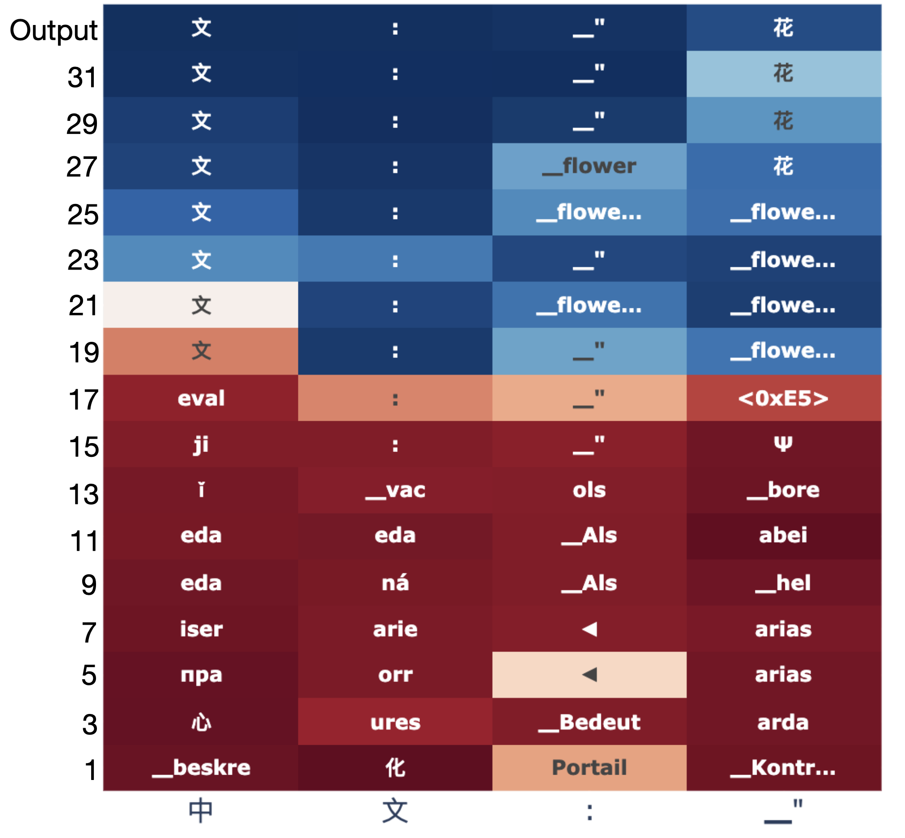
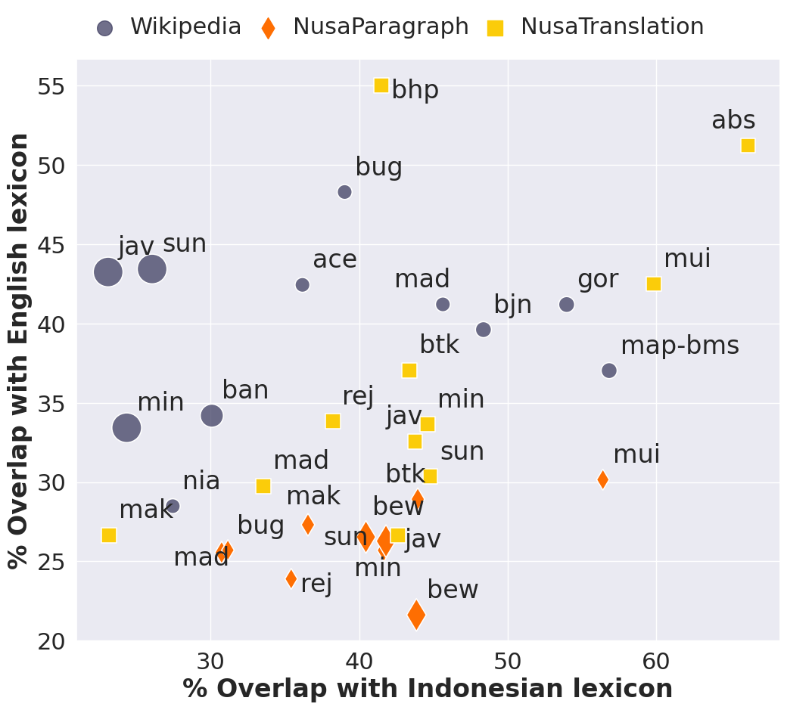

# Research proposal: language as the medium of finetuning and evaluation for Indonesian languages

## Summary

Large language models are finetuned and evaluated almost always in English, and the literature on multilingual reasoning reports that models reason at least as well in English as in the language of the question, with the advantage growing as the language gets less represented in pretraining. This project asks the converse question for a family of related, under-resourced languages: if the same task data are translated into Indonesian, Javanese, Sundanese, Minangkabau and Acehnese, the same base model is finetuned on each translation with the same recipe, and each model is evaluated on the same items in its own language, does accuracy depend on the language, and which language is the best medium?

The study is designed so that the answer can be read net of the three factors that the literature says drive cross-language gaps: the base model's pretraining exposure to each language, the competence of the translator in each language, and the tokenizer's fertility on each language. Those factors are measured per language and per item, held fixed where the tooling allows, and separated from the language where the design allows (a second base model with a different exposure profile, a round-trip translation bound, a digit re-instantiation split for contamination). The result is a set of within-language causal contrasts (gain from native tuning, anchor advantage, regression, pooling advantage), one descriptive cross-language comparison with its covariates attached, and a published set of gated, item-aligned benchmark translations for languages that have none.

Full design: [methodology.md](methodology.md). Literature: [research/5_language_as_medium.md](research/5_language_as_medium.md). Evaluation of the original plan: [plan_review.md](plan_review.md). How to run and extend it: [reproducibility.md](reproducibility.md).

## 1. Question

Holding base model, task content and pipeline fixed, does the language in which a model is finetuned and evaluated change task accuracy, and which language is the best medium?

Formally, with B(L) the untuned base accuracy in language L and A(L) the accuracy after finetuning in L, the study estimates A(L) and B(L) for each language and benchmark, the within-language contrasts G(L) = A(L) - B(L), Delta_en(L) = A_en(L) - A(L) (English-anchored finetuning against native finetuning) and Reg(L) (English regression after native finetuning), and the cross-language contrasts tau(L, L') = A(L) - A(L'). The methodology document states which of these are identified as causal effects and which are descriptive of this base model, translator and tokenizer.

The user-level framing, whether one of these languages is a "smarter" medium and whether Indonesian's supposedly small vocabulary and simple expression of intent helps or hurts, is treated as a hypothesis with measurable content: tokens per item, characters per item, bits per byte under the base model, and the position of Indonesian relative to what its exposure and fertility predict.

## 2. Why this is worth doing

- No published study runs this crossed design for Indonesian regional languages. The closest controlled comparisons vary the language of tuning data for European and major Asian languages, hold much less fixed, and rarely measure translation quality or exposure as covariates. The gap matrix in the literature note shows that no language in the set other than Indonesian has a native evaluation set for math, medicine, code or science; the translated, gated sets this study publishes are a contribution on their own.
- The literature predicts the ordering of A(L) but not its size once data are matched, and it predicts that most of the gap is exposure, tokenization and translation rather than the language. Recent controlled work finds the native penalty small (about three points) when native data are matched on a strong base, and finds that pooled multilingual tuning beats monolingual tuning even on the target's own test set. Whether either holds for Latin-script Austronesian languages with near-zero exposure is unknown.
- Practical value: teams building Indonesian and regional-language models need to know whether to translate their finetuning data, anchor to English, pivot through Indonesian, or pool. The within-language contrasts answer that directly.

## 3. Hypotheses

Stated with the observation that would count against each in the methodology (section 2):

- H1: base and native accuracy are ordered by pretraining exposure, en >= id > jv, su > min, ace.
- H2: English-anchored finetuning is at least as accurate as native finetuning on math for every regional language, and the gap is smaller on medical multiple choice.
- H3: among regional languages, gains track lexical similarity to Indonesian.
- H4: one model finetuned on the pooled languages is at least as accurate as the native model in every language at equal total rows.
- H5: the round-trip bound is positive and grows with lower exposure, and the native gap is at least as large.
- H6: the language ordering is invariant to a size-matched base model with a different exposure profile; if not, the exposure account is preferred.
- H0: the premise that Indonesian is a simpler medium predicts lower token cost and no deficit relative to English after adjusting for exposure; current tokenizers are expected to contradict the first part.

## 4. Design in brief

*Figure 1. Series S01. Rows are finetuning conditions, columns are evaluation languages. Every cell uses the same source items translated per language, the same base model, the same pinned finetuning recipe and a language-agnostic scorer.*

| Element | Choice |
|---|---|
| Languages | en (reference), id, jv, su, min, ace; more through one registry file each |
| Benchmarks | gsm8k (GSM8K test, 1,319 items, MGSM subset tagged) and medqa (MedQA test, 1,273 items); more through one registry file each, restricted to language-agnostic scorers |
| Training data | fixed 1,000-item subset of each benchmark's training source, identical ids in every language |
| Translation | Adaption Adaptive Data with a fixed blueprint and register per language; a five-step gate with FLORES-200 and NusaX calibration, per-item quality columns, a second translator and a human error-span review |
| Finetuning | Adaption AutoScientist with the optimizer pinned: one iteration, no early stop, no augmentation, hyperparameters from one recommendation call copied into every run, raw upload of the published rows; three replicates per finetuned cell |
| Evaluation | one parameterized Inspect task, numeric match or option letter, temperature 0, generous token cap, output-language fidelity and token counts logged |
| Conditions | tier 0: base, native, english_anchor, regression, round_trip; tier 1: native and english_anchor on a contrast base model; tier 2: indonesian_anchor, pooled |
| Analysis | paired item bootstrap and a mixed-effects logistic model with item and run random effects; Holm on the primary family; identification analyses for the base-model factor and item-level covariates |
| Size | tier 0 is 36 finetunes and 138 evaluation runs; the full series is 60 and 231 |

## 5. Contributions

1. The first item-paired, pipeline-controlled comparison of finetuning language across six languages including four Indonesian regional languages, with exposure, fertility and translation quality measured rather than assumed.
2. Gated, item-aligned translations of GSM8K and MedQA into id, jv, su, min and ace, published with their gate scores, human-verified subsets and excluded-item lists, plus round-trip and NLLB-200 comparison splits.
3. Per-language covariate tables (tokenizer fertility and bits per byte under current base models) for jv, su, min and ace, which no publication reports.
4. Two eval-only controls that are reusable elsewhere: the round-trip bound that charges loss to the translator without the model ever seeing the language, and a digit re-instantiation split that tests English contamination while keeping the item pairing.
5. A config-driven pipeline in which adding a language or a standard Inspect benchmark is one file, and the full sweep is derived by a planner before any paid run.

## 6. Relation to prior work

*Figure 2. Logit-lens decoding of Llama-2 on non-English prompts: middle layers favour the English token before the target-language token surfaces. English anchoring exploits this; the present study measures whether it holds for languages with near-zero exposure. Source: Wendler et al., 2024, arXiv:2402.10588.*

English-anchored reasoning (MGSM's English chain of thought, cross-lingual-thought prompting, self-translation, pivot-language instruction tuning, question alignment) is the baseline that native finetuning must beat, and it is the english_anchor condition here. Translate-train studies (MathOctopus, Bactrian-X, Okapi, Aya) and the equal-budget comparisons of monolingual against multilingual tuning motivate the pooled arm. The exposure-ceiling results (a pinch of multilinguality is enough for behaviour, but pretraining exposure bounds what instruction tuning can reach) motivate treating exposure as the primary confound and the base model as a factor. Work on Indonesian regional languages (NusaX, NusaWrites, Cendol, Komodo, Sahabat-AI, IndoMMLU, LoraxBench, MATH-IDN) supplies the resources for calibration and the evidence that the regional gap is large and register-sensitive. The statistics of evaluation (paired differences, clustered errors, small-sample coverage, seed variance, contamination across languages) fix the analysis plan.

*Figure 3. Lexicon overlap with Indonesian (x) and English (y) for Indonesian regional languages across Wikipedia, NusaParagraph and NusaTranslation. Minangkabau's closeness to Indonesian is why the design carries an Indonesian-leakage check. Source: Cahyawijaya et al., 2023, arXiv:2309.10661, repository visualization.*

What none of the prior work does is hold base model, items, translator and finetuning recipe fixed across a set of closely related low-resource languages while measuring the confounds. The novelty is the design, not a new method.

## 7. Program

| Phase | Spend | Output | Decides |
|---|---|---|---|
| 0 | none | covariate tables, premise numbers, live model catalogue | candidate base shortlist |
| 1 | about 1,000 translation rows | FLORES-100 and 50-row probes, gate scores | which languages are admitted |
| 2 | GPU hours | base accuracy in every admitted language | primary and contrast base models |
| 3 | full gsm8k translation | gated test and train splits, derived splits, verified subsets | languages that stay admitted |
| 4 | 36 one-iteration finetunes plus a variance pilot | tier 0 on gsm8k, the minimum publishable unit | replicate policy |
| 5 | medqa translation and finetunes | task-type replication | |
| 6 | 18 finetunes on the contrast base | exposure identification | whether the ordering is model-specific |
| 7 | pooled models and extra evals; series S02 to S04 | mechanism arms; adaptive optimizer; preference tuning; more benchmarks and languages | |

Series S02 lets AutoScientist optimize (three iterations) on the tier 0 cells to ask whether the platform's optimizer changes the ranking. Series S03 is preference tuning with cross-lingual consistency pairs, the original direction of this repository. Series S04 adds benchmarks (GSM8K variants, MMLU through its multilingual layout, HumanEval-XL) and the second language wave (Balinese, Banjar, Buginese, Madurese).

## 8. What the study cannot claim

With one language per structural profile, the study cannot attribute a residual gap to the language's structure. It can say which medium is best for this base model and translator, how much of the gap is translator loss, whether the ordering survives a change of base model, and how much of it item-level translation quality and token counts explain. The report states this in one paragraph next to the results.
