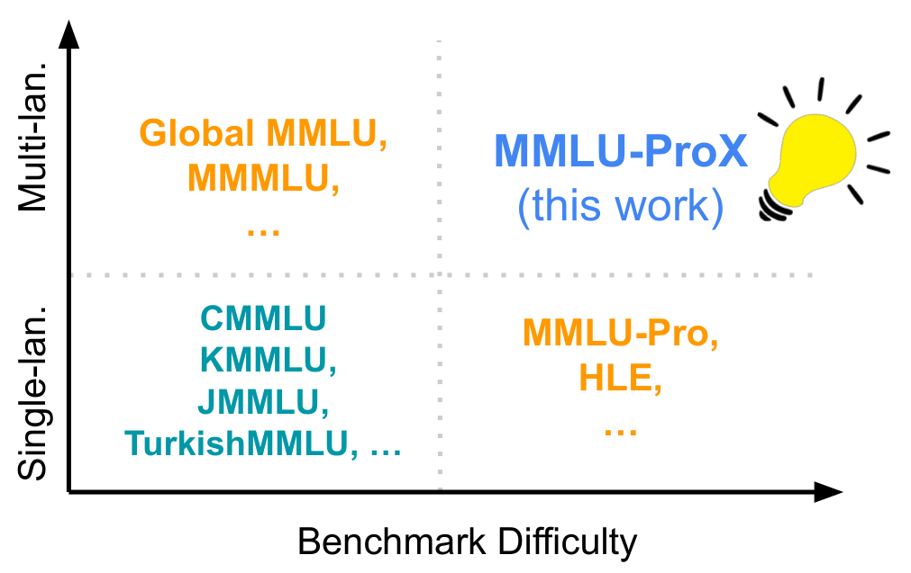

# 1. Introduction and Problem Statements

Research notes on native language finetuning of large language models (LLMs), with emphasis on low-resource languages and on comparison points from high-resource non-English languages (Mandarin, Japanese, Spanish, Arabic, etc.). This document motivates the research program and states the questions the subsequent documents address.

Companion documents:

- [2. Preliminaries and Fundamentals](2_preliminaries_fundamentals.md)
- [3. Contexts and Available Methodologies](3_contexts_methodologies.md)
- [4. Available Datasets and Evaluation Tasks](4_datasets_evaluation.md)

## 1.1 Motivation

Most open-weight LLMs are pretrained on heavily English-dominated corpora. Llama 2 reports roughly 90% English content in its pretraining mixture, with all other languages individually below 0.2% (Touvron et al., 2023, [arXiv:2307.09288](https://arxiv.org/abs/2307.09288)). This imbalance propagates into every downstream stage: tokenization, pretraining representations, instruction tuning, and preference optimization. The practical consequence is a systematic performance differential between English and non-English usage of the same model, which is largest for low-resource languages and for tasks requiring multi-step reasoning or domain knowledge.

The differential is not only a capability problem but an equity and deployment problem. INCLUDE (Romanou et al., 2024, [arXiv:2411.19799](https://arxiv.org/abs/2411.19799)) frames the performance gap between languages as a direct inhibitor of the economic and societal value of LLMs in many regions. Tokenizer disparities additionally make non-English usage more expensive and slower at identical content length (Petrov et al., 2023, [arXiv:2305.15425](https://arxiv.org/abs/2305.15425)).

## 1.2 Research questions

The research program is organized around five questions:

- **RQ1 (Degradation):** How does an LLM perform when used in a language other than English on domain tasks (medicine, programming, math, physics, general knowledge)? How large is the degradation and how does it scale with language resource level?
- **RQ2 (Internals):** How do the internals of an LLM process different languages? Is there an internal pivot language, and which components carry language-specific versus language-neutral computation?
- **RQ3 (Training data):** What multilingual pretraining and instruction-tuning datasets are available, and what are their coverage and quality properties?
- **RQ4 (Evaluation):** What multilingual evaluation benchmarks exist per task family, and what are their known pitfalls (translation artifacts, cultural bias, contamination)?
- **RQ5 (Transfer under finetuning):** How does finetuning in a low-resource language perform on tasks never seen in that language? Is it better to anchor reasoning to English first (pivot-based training) or to train directly in the native language?

RQ1 is treated below. RQ2 is treated in document 2, RQ5 in document 3, RQ3 and RQ4 in document 4.

## 1.3 Evidence of cross-lingual performance degradation (RQ1)

### 1.3.1 General knowledge and exam-style tasks

MMLU-ProX (Xuan et al., 2025, [arXiv:2503.10497](https://arxiv.org/abs/2503.10497)) extends MMLU-Pro to 29 languages with identical parallel questions and evaluates 36 state-of-the-art models. It reveals significant disparities across languages even for reasoning-enhanced and multilingual-optimized models, with degradation concentrated in lower-resource languages.

*Figure: performance disparity across languages on MMLU-ProX. Source: Xuan et al., 2025, arXiv:2503.10497, Figure 1.*

Global MMLU (Singh et al., 2024, [arXiv:2412.03304](https://arxiv.org/abs/2412.03304)) adds a second dimension to RQ1: measured degradation on translated MMLU conflates language ability with cultural bias. 28% of MMLU questions require culturally sensitive (largely Western-centric) knowledge, and 84.9% of geography-dependent questions concern North America or Europe. Model rankings change depending on whether the culturally sensitive or culturally agnostic subset is evaluated. Any degradation study must therefore separate linguistic capability from cultural knowledge mismatch.

Benchmarks built natively from regional exam sources rather than by translation confirm the gap while avoiding translation artifacts: M3Exam (Zhang et al., 2023, [arXiv:2306.05179](https://arxiv.org/abs/2306.05179)) with 12,317 real exam questions in 9 languages, INCLUDE with 197,243 QA pairs in 44 languages, and IrokoBench (Adelani et al., 2024, [arXiv:2406.03368](https://arxiv.org/abs/2406.03368)) for 16 African languages. On IrokoBench, both open and proprietary models show large drops relative to English, and open models lag proprietary ones most severely in low-resource languages.

### 1.3.2 Mathematical reasoning

MGSM (Shi et al., 2022, [arXiv:2210.03057](https://arxiv.org/abs/2210.03057)) translated 250 GSM8K problems into 10 typologically diverse languages. Findings relevant to RQ1:

- Multilingual chain-of-thought (CoT) reasoning emerges with model scale; small models fail across the board.
- Performance in underrepresented languages (Swahili, Bengali, Telugu, Thai) is substantially below English, but reasoning in English about a non-English problem (EN-CoT) recovers part of the gap. This asymmetry is a core motivation for English-anchored training methods (document 3).
- The gap correlates with language frequency in the pretraining corpus.

MSVAMP (Chen et al., 2023, [arXiv:2310.20246](https://arxiv.org/abs/2310.20246)) provides an out-of-domain multilingual math test set and confirms the same resource-level ordering. MAPO (She et al., 2024, [arXiv:2401.06838](https://arxiv.org/abs/2401.06838)) documents that reasoning quality is inconsistent across languages even when the underlying task is language-agnostic, which is the precise failure mode preference-based alignment methods target.

### 1.3.3 Medicine

Better to Ask in English (Jin et al., 2023, [arXiv:2310.13132](https://arxiv.org/abs/2310.13132)) evaluates healthcare queries under the XlingEval framework along correctness, consistency, and verifiability. Non-English responses degrade on all three axes, and the paper's title states the operative conclusion for lay users of English-centric chat models.

MMedBench (Qiu et al., 2024, [arXiv:2402.13963](https://arxiv.org/abs/2402.13963)) benchmarks medical multiple-choice QA with rationales across 6 languages. Off-the-shelf open models trail GPT-4 substantially in non-English medical QA; continued pretraining on the multilingual medical corpus MMedC closes much of the gap (MMed-Llama 3 at 8B rivals GPT-4 on MMedBench), showing the degradation is addressable with targeted domain plus language adaptation rather than being an architectural limit.

### 1.3.4 Programming

Two orthogonal multilingual axes exist for code: the programming language and the natural language of the prompt.

- MultiPL-E (Cassano et al., 2022, [arXiv:2208.08227](https://arxiv.org/abs/2208.08227)) translates HumanEval/MBPP unit tests into 18+ programming languages and shows accuracy varies strongly with programming-language resource level.
- HumanEval-XL (Peng et al., 2024, [arXiv:2402.16694](https://arxiv.org/abs/2402.16694)) crosses 23 natural languages with 12 programming languages (22,080 prompts). Code generation accuracy drops when the docstring/instruction is in a lower-resource natural language even though the target programming language is unchanged, isolating the natural-language understanding component of the degradation.

### 1.3.5 Physics and general science

Dedicated multilingual physics benchmarks are scarce; the evidence comes from science subsets of exam benchmarks. OlympiadBench (He et al., 2024, [arXiv:2402.14008](https://arxiv.org/abs/2402.14008)) contains olympiad-level bilingual (English/Chinese) math and physics problems and shows physics is markedly harder than math for all models, with bilingual deltas on top. MMLU-ProX and M3Exam science subsets show the same language ordering as their aggregate scores. This is a gap in the literature relevant to RQ4: native-language physics evaluation beyond English/Chinese is essentially unserved.

### 1.3.6 The degradation is partly a prompting artifact, partly representational

Self-translate (Etxaniz et al., 2023, [arXiv:2308.01223](https://arxiv.org/abs/2308.01223)) shows that models perform better when asked to first translate the input to English themselves and then solve, compared to direct non-English inference. Since no external translator is involved, the capability exists inside the model but is not elicited by native-language prompts. XLT cross-lingual-thought prompting (Huang et al., 2023, [arXiv:2305.07004](https://arxiv.org/abs/2305.07004)) reports over 10 points average improvement on arithmetic reasoning and open-domain QA from a purely prompt-level English anchor. These results indicate the gap measured by naive native-language evaluation overstates the representational deficit and understates the elicitation deficit. Document 2 covers the representational side; document 3 covers training methods that exploit this.

## 1.4 Summary of degradation patterns

| Domain | Benchmark evidence | Degradation pattern |
|---|---|---|
| General knowledge | MMLU-ProX, Global MMLU, INCLUDE, M3Exam, IrokoBench | Monotone in resource level; confounded by Western-centric content in translated sets |
| Math reasoning | MGSM, MSVAMP, OlympiadBench | Large for low-resource; EN-CoT recovers part of the gap; emerges with scale |
| Medicine | XlingEval, MMedBench | Correctness, consistency, verifiability all degrade; recoverable with domain+language CPT |
| Code | MultiPL-E, HumanEval-XL | Degrades with NL resource level even at fixed programming language |
| Physics/science | OlympiadBench, M3Exam/MMLU-ProX subsets | Same ordering; benchmark coverage itself is thin outside EN/ZH |
| Open-ended generation | MEGA, BenchMAX, X-AlpacaEval | Fluency often preserved for high-resource, factuality and helpfulness degrade earlier |

## 1.5 Problem statement for this project

Given an English-centric base model and a target native language (particularly low-resource), the problem is to choose a finetuning strategy that:

1. Maximizes target-language task performance, including on task types never seen in the target language during finetuning (cross-lingual task generalization, RQ5).
2. Minimizes regression of the base model's English and reasoning capabilities (avoiding capability forgetting and the curse of multilinguality, see document 2).
3. Chooses between, or combines, two families: (a) anchoring, where the model is trained to route through English internally (pivot training, question alignment, preference alignment toward dominant-language reasoning), and (b) direct native training (continued pretraining and instruction tuning in the target language, possibly with vocabulary extension).
4. Is evaluated on benchmarks that separate linguistic competence from cultural knowledge and avoid translationese artifacts.

Working hypotheses drawn from the literature (to be tested):

- **H1:** For reasoning-heavy tasks in low-resource languages, English-anchored methods (PLUG, QAlign, MAPO) outperform direct native-language finetuning at equal data budget, because they exploit the model's internal English-biased concept space.
- **H2:** For knowledge-heavy, culturally grounded, and generation-quality tasks, direct native adaptation (continued pretraining as in Swallow or Sailor) is required and anchoring is insufficient.
- **H3:** A small amount of multilingual instruction data (tens to hundreds of examples, per Shaham et al. and Kew et al.) is enough to unlock instruction following in the target language, but not to add knowledge.
- **H4:** Preference optimization with cross-lingual consistency signals (MAPO, language-imbalance rewarding) improves low-resource reasoning without parallel human annotation.

## References

- Touvron et al., 2023. Llama 2: Open Foundation and Fine-Tuned Chat Models. [arXiv:2307.09288](https://arxiv.org/abs/2307.09288)
- Shi et al., 2022. Language Models are Multilingual Chain-of-Thought Reasoners. ICLR 2023. [arXiv:2210.03057](https://arxiv.org/abs/2210.03057)
- Xuan et al., 2025. MMLU-ProX: A Multilingual Benchmark for Advanced Large Language Model Evaluation. [arXiv:2503.10497](https://arxiv.org/abs/2503.10497)
- Singh et al., 2024. Global MMLU: Understanding and Addressing Cultural and Linguistic Biases in Multilingual Evaluation. [arXiv:2412.03304](https://arxiv.org/abs/2412.03304)
- Romanou et al., 2024. INCLUDE: Evaluating Multilingual Language Understanding with Regional Knowledge. ICLR 2025. [arXiv:2411.19799](https://arxiv.org/abs/2411.19799)
- Zhang et al., 2023. M3Exam: A Multilingual, Multimodal, Multilevel Benchmark. NeurIPS 2023 Datasets and Benchmarks. [arXiv:2306.05179](https://arxiv.org/abs/2306.05179)
- Adelani et al., 2024. IrokoBench: A New Benchmark for African Languages. [arXiv:2406.03368](https://arxiv.org/abs/2406.03368)
- Chen et al., 2023. Breaking Language Barriers in Multilingual Mathematical Reasoning (MathOctopus, MSVAMP). [arXiv:2310.20246](https://arxiv.org/abs/2310.20246)
- She et al., 2024. MAPO: Advancing Multilingual Reasoning through Multilingual Alignment-as-Preference Optimization. ACL 2024. [arXiv:2401.06838](https://arxiv.org/abs/2401.06838)
- Jin et al., 2023. Better to Ask in English: Cross-Lingual Evaluation of LLMs for Healthcare Queries. WWW 2024. [arXiv:2310.13132](https://arxiv.org/abs/2310.13132)
- Qiu et al., 2024. Towards Building Multilingual Language Model for Medicine (MMedC, MMedBench). [arXiv:2402.13963](https://arxiv.org/abs/2402.13963)
- Cassano et al., 2022. MultiPL-E: A Scalable and Extensible Approach to Benchmarking Neural Code Generation. [arXiv:2208.08227](https://arxiv.org/abs/2208.08227)
- Peng et al., 2024. HumanEval-XL: A Multilingual Code Generation Benchmark. LREC-COLING 2024. [arXiv:2402.16694](https://arxiv.org/abs/2402.16694)
- He et al., 2024. OlympiadBench: A Challenging Benchmark for Promoting AGI with Olympiad-Level Bilingual Multimodal Scientific Problems. ACL 2024. [arXiv:2402.14008](https://arxiv.org/abs/2402.14008)
- Etxaniz et al., 2023. Do Multilingual Language Models Think Better in English? NAACL 2024. [arXiv:2308.01223](https://arxiv.org/abs/2308.01223)
- Huang et al., 2023. Not All Languages Are Created Equal in LLMs: Cross-Lingual-Thought Prompting (XLT). EMNLP 2023 Findings. [arXiv:2305.07004](https://arxiv.org/abs/2305.07004)
- Petrov et al., 2023. Language Model Tokenizers Introduce Unfairness Between Languages. NeurIPS 2023. [arXiv:2305.15425](https://arxiv.org/abs/2305.15425)
- Ahuja et al., 2023. MEGA: Multilingual Evaluation of Generative AI. EMNLP 2023. [arXiv:2303.12528](https://arxiv.org/abs/2303.12528)
- Huang et al., 2025. BenchMAX: A Comprehensive Multilingual Evaluation Suite for Large Language Models. [arXiv:2502.07346](https://arxiv.org/abs/2502.07346)
