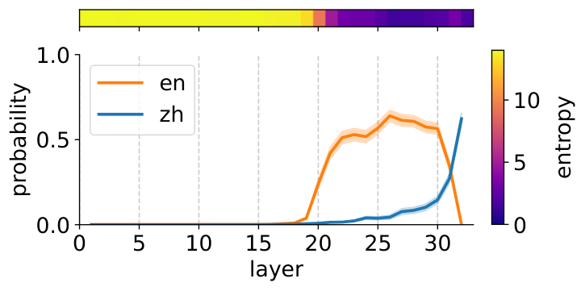
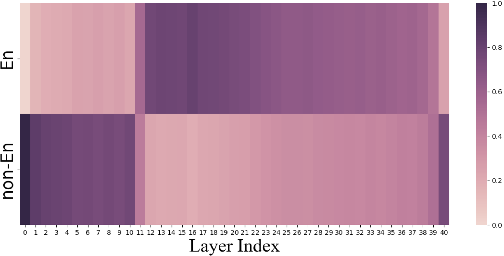
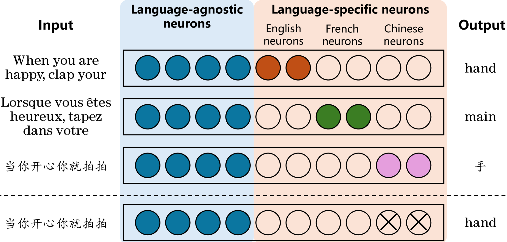
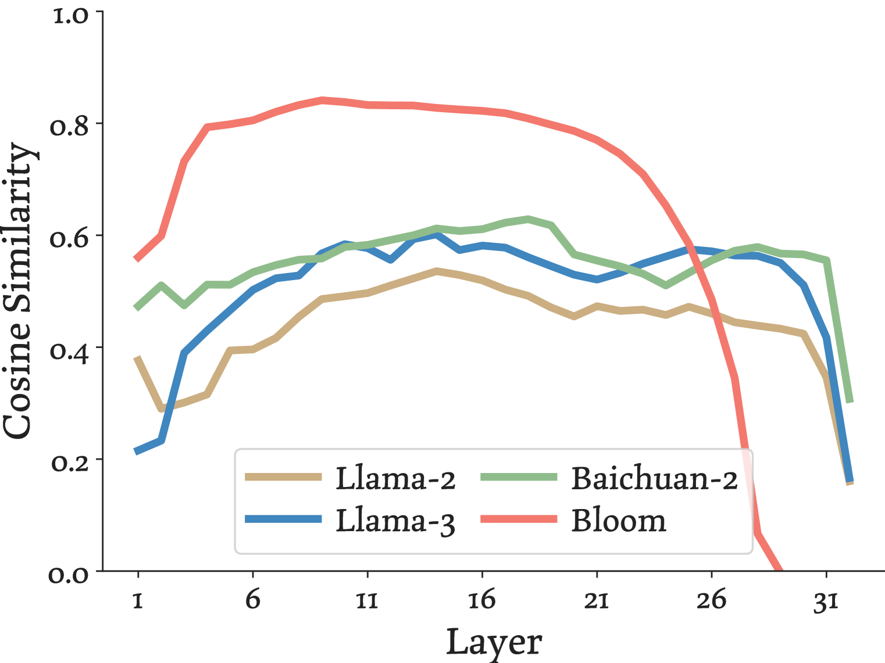

# 2. Preliminaries and Fundamentals

Terminology, tokenization effects, and the internal mechanics of multilingual language models (RQ2). The mechanistic findings here directly motivate the choice between English-anchored and direct native finetuning discussed in [document 3](3_contexts_methodologies.md).

## 2.1 Terminology

- **High-resource / low-resource language:** informal classification by the volume of digitized text available for pretraining. English, Mandarin, Spanish, French, German, Japanese are high-resource; languages such as Swahili, Bengali (relative to speaker count), Yoruba, Lao, and most African and Indigenous languages are low-resource. Resource level is corpus-relative: a language can be high-resource by speakers and low-resource in web data.
- **Cross-lingual transfer:** capability learned in a source language (usually English) manifesting in a target language without target-language supervision for that capability.
- **Zero-shot cross-lingual transfer:** finetune on task data in language A, evaluate the task in language B with no B task data (Pires et al., 2019, [arXiv:1906.01502](https://arxiv.org/abs/1906.01502); Artetxe et al., 2019, [arXiv:1910.11856](https://arxiv.org/abs/1910.11856)).
- **Translate-train:** machine-translate the training set into the target language(s), then finetune.
- **Translate-test:** machine-translate the test input into English at inference and run the English model. With strong MT and train/test mismatch mitigation, translate-test is much stronger than commonly assumed, and the optimal choice is task-dependent (Artetxe et al., 2023, [arXiv:2305.14240](https://arxiv.org/abs/2305.14240)).
- **Self-translate:** translate-test without an external MT system; the model translates its own input first (Etxaniz et al., 2023, [arXiv:2308.01223](https://arxiv.org/abs/2308.01223)).
- **Pivot / anchor language:** a high-resource language (almost always English) used as the internal or explicit intermediate representation for instruction processing or chain-of-thought.
- **Curse of multilinguality:** at fixed model capacity, adding languages improves low-resource transfer up to a point, after which per-language performance degrades due to capacity dilution (Conneau et al., 2019, XLM-R, [arXiv:1911.02116](https://arxiv.org/abs/1911.02116)).
- **Continued/continual pretraining (CPT):** further autoregressive pretraining of a base model on target-language corpora before any instruction tuning.
- **Fertility:** average number of tokens produced per word (or per character) by a tokenizer; higher fertility means longer sequences for the same content.

## 2.2 Tokenization: degradation begins before the model runs

Petrov et al. (2023, [arXiv:2305.15425](https://arxiv.org/abs/2305.15425)) show the same text translated across languages can differ in tokenized length by up to 15x, and byte-level models still show over 4x differences for some pairs. Consequences: higher API cost, higher latency, shorter effective context windows, and a harder learning problem (more fragmented morphemes) for non-English languages. Tokenizer choice measurably affects downstream multilingual model quality and training cost (Ali et al., 2023, [arXiv:2310.08754](https://arxiv.org/abs/2310.08754)).

Practical implication for finetuning: vocabulary extension (adding target-language tokens and continuing pretraining) reduces fertility and inference cost, and is a standard component of native adaptation pipelines (Chinese-LLaMA, [arXiv:2304.08177](https://arxiv.org/abs/2304.08177); Swallow, [arXiv:2404.17790](https://arxiv.org/abs/2404.17790)). However, vocabulary extension is not automatically beneficial at small CPT scale (Zhao et al., 2024, LLaMA Beyond English, [arXiv:2401.01055](https://arxiv.org/abs/2401.01055)); details in document 3.

## 2.3 Classical fundamentals from the encoder era

Findings from mBERT/XLM-R transfer directly to decoder LLMs and set the baseline expectations:

- mBERT, trained on 104 languages with no parallel data, performs surprisingly good zero-shot cross-lingual transfer; transfer is strongest between typologically similar languages and works across scripts, implying an emergent shared interlingual space (Pires et al., 2019, [arXiv:1906.01502](https://arxiv.org/abs/1906.01502)).
- XLM-R establishes the positive-transfer versus capacity-dilution trade-off (curse of multilinguality) and shows scale postpones it: at sufficient capacity, multilingual models match strong monolingual ones (Conneau et al., 2019, [arXiv:1911.02116](https://arxiv.org/abs/1911.02116)).
- Geometrically, languages occupy similar linear subspaces after mean-centering; language identity is encoded along language-sensitive axes stable through middle layers, while language-neutral axes encode position and part-of-speech. Shifting a representation by the difference of language means induces predictions in the other language (Chang et al., 2022, [arXiv:2205.10964](https://arxiv.org/abs/2205.10964)). This mean-shift result prefigures the steering results on decoder LLMs below.
- Monolingual (English-only) representations transfer to other languages with a learned embedding layer alone, showing the transferability is not an artifact of shared subword vocabularies (Artetxe et al., 2019, [arXiv:1910.11856](https://arxiv.org/abs/1910.11856)).

## 2.4 Internals of decoder LLMs across languages (RQ2)

### 2.4.1 The latent-English / concept-space account

Wendler et al. (2024, Do Llamas Work in English?, [arXiv:2402.10588](https://arxiv.org/abs/2402.10588), ACL 2024) apply the logit lens to Llama-2 on non-English prompts with a unique correct single-token continuation. Intermediate embeddings pass through three phases:

1. **Input space** (early layers): far from any output token embedding.
2. **Concept space** (middle layers): the correct next token is already decodable, but its English version receives higher probability than the input-language version.
3. **Output space** (late layers): probability mass moves to the input-language token.

The interpretation is that the shared concept space lies closer to English than to other languages because of English-dominated pretraining, not that the model literally translates through English text.

*Figure: logit-lens decoding of Llama-2 for Chinese and French prompts; middle layers favor English token variants. Source: Wendler et al., 2024, arXiv:2402.10588.*

*Figure: layerwise probability of the English token (blue) versus the Chinese target token (orange) and entropy, Llama-2 7B. The English variant dominates in the middle layers. Source: Wendler et al., 2024, arXiv:2402.10588.*

Dumas et al. (2025, Do Multilingual LLMs Think In English?, [arXiv:2502.15603](https://arxiv.org/abs/2502.15603)) strengthen this: for French, German, Dutch, and Mandarin, semantically loaded words surface first in English-adjacent representations before being rendered in the target language, and activation steering vectors computed in English are more effective than vectors computed in the input/output language. Operationally, key decisions are made in an English-shaped representation space regardless of the surface language.

### 2.4.2 The layered workflow account (MWork)

Zhao et al. (2024, How do Large Language Models Handle Multilingualism?, [arXiv:2402.18815](https://arxiv.org/abs/2402.18815), NeurIPS 2024) propose and validate the MWork hypothesis: early layers convert multilingual input into an English-leaning internal form (understanding), middle layers think in English via self-attention while feed-forward structures incorporate multilingual knowledge, and final layers generate output in the query language. Their Parallel Language-specific Neuron Detection (PLND) identifies language-specific neurons without labeled data; deactivating them selectively degrades exactly the predicted stages. Finetuning only language-specific neurons with small data improves multilingual ability, a directly actionable result for parameter-efficient native finetuning.

*Figure: the MWork multilingual workflow hypothesis. Source: Zhao et al., 2024, arXiv:2402.18815, Figure 1.*

### 2.4.3 Language-specific neurons and regions

- LAPE (Tang et al., 2024, Language-Specific Neurons, [arXiv:2402.16438](https://arxiv.org/abs/2402.16438), ACL 2024): language activation probability entropy identifies a small subset of neurons, concentrated in the top and bottom layers, that govern processing of a given language. Activating or deactivating them steers the output language. This is consistent with MWork's placement of language-specific processing at the model's boundaries and language-neutral computation in the middle.

*Figure: identification of language-specific neurons via LAPE. Source: Tang et al., 2024, arXiv:2402.16438, Figure 1.*

- Linguistic regions (Zhang et al., 2024, [arXiv:2402.14700](https://arxiv.org/abs/2402.14700)): a core linguistic-competence region of about 1% of parameters exists such that zeroing it collapses performance in 30 languages; distinct monolingual regions exist per language, and perturbing single dimensions within the core region destroys linguistic competence. Freezing the core region during further pretraining mitigates catastrophic forgetting of linguistic ability.

### 2.4.4 The semantic hub account

Wu et al. (2024, The Semantic Hub Hypothesis, [arXiv:2411.04986](https://arxiv.org/abs/2411.04986), ICLR 2025) generalize beyond languages: models place semantically equivalent inputs from different languages (and modalities: code, arithmetic, images, audio) near one another in intermediate layers, and this hub is interpretable through the dominant pretraining language via the logit lens. Interventions in the hub in one language predictably change outputs in another, evidence that the shared space is causally used, not epiphenomenal.

*Figure: the semantic hub across languages and modalities. Source: Wu et al., 2024, arXiv:2411.04986, Figure 1.*

### 2.4.5 Synthesis

The four accounts agree on a sandwich architecture:

| Layers | Function | Language character |
|---|---|---|
| Bottom | de-tokenize, map surface form into shared space | language-specific |
| Middle | semantics, reasoning, knowledge retrieval | shared, biased toward English (or the dominant pretraining language) |
| Top | re-tokenize, render into output language | language-specific |

Two consequences for finetuning strategy:

1. **Anchoring is aligned with the mechanism.** Methods that route reasoning through English (prompt-level XLT and self-translate; training-level PLUG, QAlign; preference-level MAPO) exploit the middle layers where the model is strongest. The degradation measured in native-language evaluation is partly an elicitation failure at the input/output interfaces rather than an absence of capability.
2. **Direct native adaptation targets the interfaces plus knowledge.** CPT with vocabulary extension improves the language-specific boundary layers and injects missing target-language and cultural knowledge into the feed-forward stores, which anchoring cannot supply. The linguistic-region and language-neuron results suggest parameter-efficient variants: train only language-specific neurons or protect the core region to avoid forgetting.

## References

- Pires et al., 2019. How multilingual is Multilingual BERT? ACL 2019. [arXiv:1906.01502](https://arxiv.org/abs/1906.01502)
- Artetxe et al., 2019. On the Cross-lingual Transferability of Monolingual Representations. ACL 2020. [arXiv:1910.11856](https://arxiv.org/abs/1910.11856)
- Conneau et al., 2019. Unsupervised Cross-lingual Representation Learning at Scale (XLM-R). ACL 2020. [arXiv:1911.02116](https://arxiv.org/abs/1911.02116)
- Chang et al., 2022. The Geometry of Multilingual Language Model Representations. EMNLP 2022. [arXiv:2205.10964](https://arxiv.org/abs/2205.10964)
- Petrov et al., 2023. Language Model Tokenizers Introduce Unfairness Between Languages. NeurIPS 2023. [arXiv:2305.15425](https://arxiv.org/abs/2305.15425)
- Ali et al., 2023. Tokenizer Choice For LLM Training: Negligible or Crucial? NAACL 2024 Findings. [arXiv:2310.08754](https://arxiv.org/abs/2310.08754)
- Wendler et al., 2024. Do Llamas Work in English? On the Latent Language of Multilingual Transformers. ACL 2024. [arXiv:2402.10588](https://arxiv.org/abs/2402.10588)
- Dumas et al., 2025. Do Multilingual LLMs Think In English? [arXiv:2502.15603](https://arxiv.org/abs/2502.15603)
- Zhao et al., 2024. How do Large Language Models Handle Multilingualism? NeurIPS 2024. [arXiv:2402.18815](https://arxiv.org/abs/2402.18815)
- Tang et al., 2024. Language-Specific Neurons: The Key to Multilingual Capabilities in Large Language Models. ACL 2024. [arXiv:2402.16438](https://arxiv.org/abs/2402.16438)
- Zhang et al., 2024. Unveiling Linguistic Regions in Large Language Models. ACL 2024. [arXiv:2402.14700](https://arxiv.org/abs/2402.14700)
- Wu et al., 2024. The Semantic Hub Hypothesis. ICLR 2025. [arXiv:2411.04986](https://arxiv.org/abs/2411.04986)
- Artetxe et al., 2023. Revisiting Machine Translation for Cross-lingual Classification. EMNLP 2023. [arXiv:2305.14240](https://arxiv.org/abs/2305.14240)
- Etxaniz et al., 2023. Do Multilingual Language Models Think Better in English? NAACL 2024. [arXiv:2308.01223](https://arxiv.org/abs/2308.01223)
- Zhao et al., 2024. LLaMA Beyond English: An Empirical Study on Language Capability Transfer. [arXiv:2401.01055](https://arxiv.org/abs/2401.01055)
- Cui et al., 2023. Efficient and Effective Text Encoding for Chinese LLaMA and Alpaca. [arXiv:2304.08177](https://arxiv.org/abs/2304.08177)
- Fujii et al., 2024. Continual Pre-Training for Cross-Lingual LLM Adaptation: Enhancing Japanese Language Capabilities (Swallow). COLM 2024. [arXiv:2404.17790](https://arxiv.org/abs/2404.17790)
