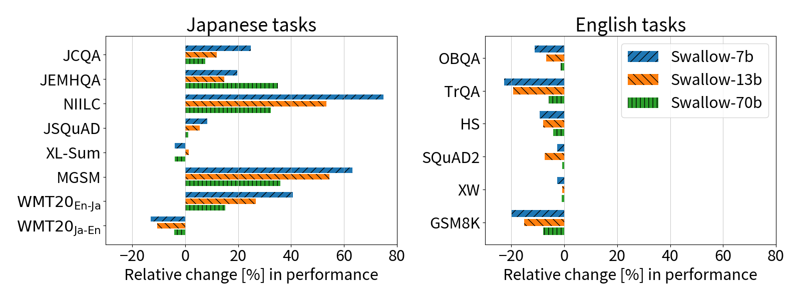
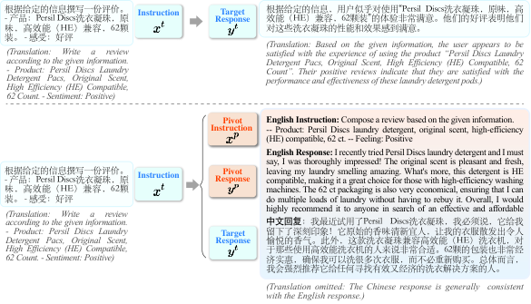
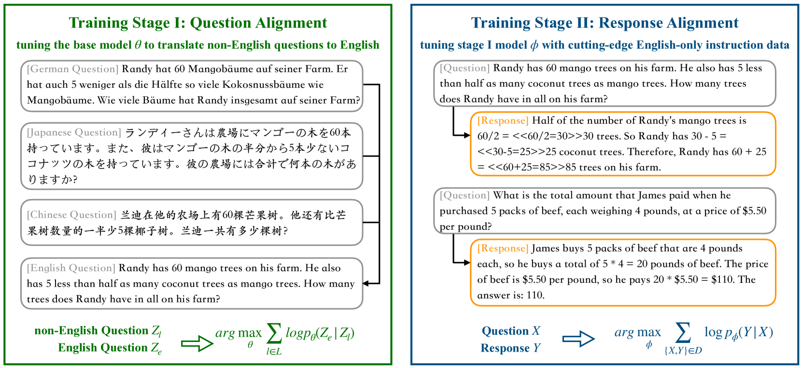
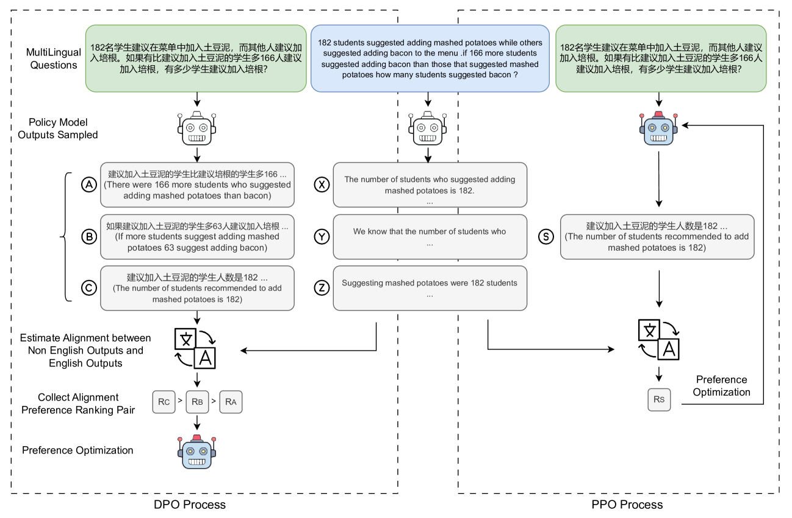

# 3. Contexts and Available Methodologies

Survey of finetuning and adaptation methods for native (non-English) language capability, organized by training stage. Covers RQ5: how low-resource finetuning generalizes to unseen tasks, and English-anchored versus direct native training. Grounding for terms and mechanisms is in [document 2](2_preliminaries_fundamentals.md); datasets and benchmarks referenced here are cataloged in [document 4](4_datasets_evaluation.md).

## 3.1 Taxonomy

| Family | Representative methods | Data need | What it fixes |
|---|---|---|---|
| Continued pretraining (CPT) | Swallow, Chinese-LLaMA, Sailor, SeaLLMs, Jais, Tower, MMedC CPT | 10B-400B target-language tokens | Interface layers + target-language knowledge |
| Vocabulary/tokenizer extension | Chinese-LLaMA, Swallow | paired with CPT | Fertility, cost, sequence length |
| Multilingual instruction tuning | Aya, BLOOMZ/mT0, Bactrian-X, Okapi, pinch-of-multilinguality | 1e2-1e6 instructions | Instruction following in target language |
| English-anchored (pivot) training | PLUG, QAlign, xCoT | parallel questions or pivot CoT | Reasoning elicitation in target language |
| Preference optimization | MAPO, language-imbalance rewarding | preference pairs (can be synthetic) | Reasoning consistency across languages |
| Inference-time anchoring | XLT prompting, self-translate, translate-test | none (prompting) | Elicitation without training |
| Modular / parameter-efficient | MAD-X adapters, LoRA (Bactrian-X), language-neuron finetuning (PLND) | small | Isolation of language-specific parameters, forgetting control |

## 3.2 Continued pretraining and vocabulary extension

**Swallow** (Fujii et al., 2024, [arXiv:2404.17790](https://arxiv.org/abs/2404.17790)) extends Llama 2 with Japanese vocabulary and runs CPT on a large Japanese web corpus. Findings: Japanese task performance improves drastically and monotonically up to 100B tokens; vocabulary extension improves training/inference efficiency; parallel corpora help translation-related abilities. Swallow outperforms models trained from scratch on English+Japanese at comparable compute, establishing CPT as the cost-effective route for high-resource-ish target languages.

*Figure: continual pretraining effect on Japanese benchmarks, Llama 2 vs Swallow. Source: Fujii et al., 2024, arXiv:2404.17790.*

**Chinese-LLaMA/Alpaca** (Cui et al., 2023, [arXiv:2304.08177](https://arxiv.org/abs/2304.08177)) is the template pipeline: extend tokenizer with 20K Chinese tokens, CPT with LoRA, then Chinese instruction tuning. Fertility for Chinese drops substantially, and Chinese understanding/generation improve over base LLaMA.

**LLaMA Beyond English** (Zhao et al., 2024, [arXiv:2401.01055](https://arxiv.org/abs/2401.01055)) is the cautionary counterpoint from a 1440-GPU-hour ablation: vocabulary extension can hurt when CPT data is limited (under roughly the 10B-token scale); strong target-language response quality (fluency, instruction adherence) is achievable with under 1% of the original pretraining data, but knowledge-level performance (C-Eval, MMLU-class) improves little without large-scale CPT. Transfer of fluency is cheap; transfer of knowledge is expensive.

**Regional model families:** Sailor (Dou et al., 2024, [arXiv:2404.03608](https://arxiv.org/abs/2404.03608)) does CPT from Qwen1.5 on 200B-400B SEA-language tokens with BPE dropout, aggressive deduplication, and proxy-model-optimized data mixtures. SeaLLMs (Nguyen et al., 2023, [arXiv:2312.00738](https://arxiv.org/abs/2312.00738)) adds vocabulary extension and hybrid instruction data for SEA languages. Jais (Sengupta et al., 2023, [arXiv:2308.16149](https://arxiv.org/abs/2308.16149)) trains Arabic-centric models from scratch on a 46% Arabic / 54% English+code mixture, showing bilingual-from-scratch is viable when enough target data exists. InkubaLM (Tonja et al., 2024, [arXiv:2408.17024](https://arxiv.org/abs/2408.17024)) targets five African languages at 0.4B scale, the small-model low-resource extreme. Tower (Alves et al., 2024, [arXiv:2402.17733](https://arxiv.org/abs/2402.17733)) specializes CPT+IT for translation-related tasks across 10 languages.

**Domain-specific CPT:** MMedC (Qiu et al., 2024, [arXiv:2402.13963](https://arxiv.org/abs/2402.13963)), a 25.5B-token multilingual medical corpus; MMed-Llama 3 8B after CPT rivals GPT-4 on MMedBench. Demonstrates stacked adaptation (language + domain) works.

## 3.3 Multilingual instruction tuning: how much multilinguality is needed?

Three studies converge on "very little, for behavior":

- **A pinch of multilinguality** (Shaham et al., 2024, [arXiv:2401.01854](https://arxiv.org/abs/2401.01854)): as few as 40 multilingual examples in an otherwise English tuning set substantially improve multilingual instruction following, including for languages unseen in tuning; 2-4 languages of diversification already improve cross-lingual generalization; multilingual mixtures match monolingual tuning with 10x fewer per-language examples.
- **Turning English-centric LLMs into polyglots** (Kew et al., 2023, [arXiv:2312.12683](https://arxiv.org/abs/2312.12683)): multilingual instruction tuning with only 2-3 languages is necessary and sufficient for cross-lingual response generalization; the ceiling is set by how much the target language was seen in pretraining; matters most for generative, language-agreement tasks (chat), least for structured classification.
- **Zero-shot cross-lingual IT** (Chirkova & Nikoulina, 2024, [arXiv:2402.14778](https://arxiv.org/abs/2402.14778)): English-only instruction tuning transfers to other languages if hyperparameters account for multilinguality and IT data is large enough; transferred responses are correct-language and helpful but weaker on factuality.

Together with Kew's ceiling observation, the division of labor is: **pretraining exposure determines the ceiling; instruction tuning cheaply unlocks behavior up to that ceiling; CPT is what raises the ceiling.**

Larger-scale instruction resources: BLOOMZ/mT0 via xP3 (Muennighoff et al., 2022, [arXiv:2211.01786](https://arxiv.org/abs/2211.01786)) show English-only multitask finetuning of a multilingual base already generalizes tasks to pretraining-corpus languages, multilingual task mixtures improve it further, and models generalize zero-shot to tasks in languages never intentionally seen. Aya (Üstün et al., 2024, [arXiv:2402.07827](https://arxiv.org/abs/2402.07827)) instruction-tunes mT5 on 99+ languages against the Aya Dataset/Collection. Bactrian-X (Li et al., 2023, [arXiv:2305.15011](https://arxiv.org/abs/2305.15011)) provides 3.4M translated instruction pairs in 52 languages with LoRA adapters. Okapi (Lai et al., 2023, [arXiv:2307.16039](https://arxiv.org/abs/2307.16039)) adds RLHF in 26 languages.

Relevance to RQ5 (unseen-task generalization in low-resource languages): the xP3 result is the key positive evidence. Task generalization is largely language-agnostic once the base model has pretraining exposure to the language; instruction tuning in any language (even English only) transfers task ability, with quality bounded by pretraining exposure.

## 3.4 English-anchored (pivot) training methods

These methods deliberately exploit the English-biased concept space (document 2, section 2.4).

**PLUG: pivot language guided generation** (Zhang et al., 2023, [arXiv:2311.08711](https://arxiv.org/abs/2311.08711), ICLR 2024). Trains the model to first produce the instruction processing (understanding plus draft response) in English, then produce the target-language response. Average 29% improvement in instruction-following over direct target-language response training on X-AlpacaEval (Chinese, Korean, Italian, Spanish). Alternative pivots also work but English is strongest.

*Figure: PLUG training format, English as pivot. Source: Zhang et al., 2023, arXiv:2311.08711.*

**QAlign: question translation training** (Zhu et al., 2024, [arXiv:2401.07817](https://arxiv.org/abs/2401.07817), ACL 2024 Findings). Two stages: (1) finetune on X-to-English parallel questions so the model aligns target-language questions to English internally; (2) standard English instruction tuning on reasoning data. No target-language CoT data needed. On LLaMA2-13B: +11.3% and +16.1% average accuracy over translate-train across ten languages on MGSM and MSVAMP. Beats translate-train because machine-translated CoT is noisy for math formatting, while question alignment sidesteps generating translated reasoning entirely.

*Figure: question translation training pipeline. Source: Zhu et al., 2024, arXiv:2401.07817, Figure 1.*

**xCoT** (Chai et al., 2024, [arXiv:2401.07037](https://arxiv.org/abs/2401.07037)): cross-lingual instruction tuning with code-switched in-context examples (xICL) and online random pivoting (translate the query to another language, then reason). Targets the same gap with a data-augmentation flavor.

**Inference-time anchors** (no training): XLT prompting (Huang et al., 2023, [arXiv:2305.07004](https://arxiv.org/abs/2305.07004)) gains over 10 points on arithmetic reasoning and open-domain QA by prompting the model to think cross-lingually via English. Self-translate (Etxaniz et al., 2023, [arXiv:2308.01223](https://arxiv.org/abs/2308.01223)) and strengthened translate-test (Artetxe et al., 2023, [arXiv:2305.14240](https://arxiv.org/abs/2305.14240)) are the zero-training baselines any anchored finetuning must beat.

**Translate-train** (baseline family): translate English instruction/reasoning data into targets and finetune, as in MathOctopus (Chen et al., 2023, [arXiv:2310.20246](https://arxiv.org/abs/2310.20246)), which builds MGSM8KInstruct and MSVAMP and shows multilingual SFT beats English-only SFT for multilingual math. QAlign's comparison shows translate-train is dominated for reasoning when CoT translation quality is the bottleneck; Bactrian-X shows it scales cheaply for general instructions.

## 3.5 Preference optimization across languages

**MAPO** (She et al., 2024, [arXiv:2401.06838](https://arxiv.org/abs/2401.06838), ACL 2024). Uses an off-the-shelf translation model to score consistency between a non-dominant-language reasoning trace and the dominant-language (English) trace; the consistency score forms preference pairs optimized with DPO or PPO. Improvements: +16.2% MSVAMP, +6.1% MGSM, +13.3% MNumGLUESub, with improved cross-language reasoning consistency. No human preference annotation in the target languages is required.

*Figure: multilingual alignment-as-preference optimization. Source: She et al., 2024, arXiv:2401.06838, Figure 1.*

**Language imbalance driven rewarding** (Yang et al., 2024, [arXiv:2410.08964](https://arxiv.org/abs/2410.08964), ICLR 2025). Treats the inherent quality gap between dominant and non-dominant languages as a free reward signal: dominant-language responses (translated across languages) are preferred over native non-dominant responses, and iterative DPO bootstraps both non-dominant and dominant performance (about 7.5% average improvement over two iterations on instruction following and arithmetic reasoning with Llama-3-8B-Instruct).

These two are the closest prior art for this repository's native preference tuning direction: both convert cross-lingual asymmetry into preference data without human labels.

## 3.6 Modular and parameter-efficient approaches

- **MAD-X** (Pfeiffer et al., 2020, [arXiv:2005.00052](https://arxiv.org/abs/2005.00052)): language adapters plus task adapters plus invertible adapters; arbitrary language/task composition, strong on unseen low-resource languages, the classic pre-LLM formulation of "separate language from task."
- **LoRA-per-language** (Bactrian-X, [arXiv:2305.15011](https://arxiv.org/abs/2305.15011)): language-specific low-rank adapters over a shared base.
- **Language-neuron finetuning** (PLND, Zhao et al., 2024, [arXiv:2402.18815](https://arxiv.org/abs/2402.18815)): finetune only detected language-specific neurons with hundreds of examples to improve a target language while leaving shared reasoning untouched.
- **Core-region freezing** (Zhang et al., 2024, [arXiv:2402.14700](https://arxiv.org/abs/2402.14700)): freezing the roughly 1% core linguistic region during further pretraining mitigates catastrophic forgetting, a cheap guard for CPT pipelines.

## 3.7 Anchor-to-English versus direct native training: decision summary

| Criterion | English-anchored (PLUG/QAlign/MAPO/XLT) | Direct native (CPT + native IT) |
|---|---|---|
| Reasoning tasks (math, logic) | Strong; exploits English concept space; QAlign +11-16% over translate-train | Weaker per token of data; translate-train CoT noisy |
| Target-language knowledge, cultural content | Not addressed; anchor cannot add missing knowledge | Addressed; requires 10B+ tokens CPT for knowledge gains |
| Generation quality / naturalness in target | Risk of translationese; PLUG mitigates by generating target response conditioned on pivot | Best; Swallow/Sailor show monotone gains |
| Data requirement | Parallel questions or none (prompting) | Large monolingual corpora; scarce for low-resource languages |
| Low-resource feasibility | High; MGSM shows EN-CoT recovers gap for Swahili/Bengali | Limited by corpus availability; InkubaLM-scale efforts |
| Unseen-task generalization (RQ5) | Inherits English task generality through the anchor | Present but bounded by pretraining exposure (xP3, Kew) |
| English/base capability retention | High; base largely untouched | Forgetting risk; needs replay or region freezing |

Working recommendation for this project: for a low-resource target language, combine (1) question/instruction alignment to English (QAlign-style) for reasoning elicitation, (2) a small multilingual instruction mixture (pinch-scale) for behavior, (3) preference optimization using cross-lingual consistency (MAPO-style or language-imbalance rewarding) as the native preference tuning stage, and (4) CPT only if a usable target corpus exists and knowledge-heavy tasks matter. Evaluate against inference-time anchors (self-translate, XLT) as no-training baselines.

## References

- Fujii et al., 2024. Continual Pre-Training for Cross-Lingual LLM Adaptation (Swallow). COLM 2024. [arXiv:2404.17790](https://arxiv.org/abs/2404.17790)
- Cui et al., 2023. Efficient and Effective Text Encoding for Chinese LLaMA and Alpaca. [arXiv:2304.08177](https://arxiv.org/abs/2304.08177)
- Zhao et al., 2024. LLaMA Beyond English: An Empirical Study on Language Capability Transfer. [arXiv:2401.01055](https://arxiv.org/abs/2401.01055)
- Dou et al., 2024. Sailor: Open Language Models for South-East Asia. [arXiv:2404.03608](https://arxiv.org/abs/2404.03608)
- Nguyen et al., 2023. SeaLLMs: Large Language Models for Southeast Asia. ACL 2024 demo. [arXiv:2312.00738](https://arxiv.org/abs/2312.00738)
- Sengupta et al., 2023. Jais and Jais-chat: Arabic-Centric Foundation and Instruction-Tuned LLMs. [arXiv:2308.16149](https://arxiv.org/abs/2308.16149)
- Tonja et al., 2024. InkubaLM: A small language model for low-resource African languages. [arXiv:2408.17024](https://arxiv.org/abs/2408.17024)
- Alves et al., 2024. Tower: An Open Multilingual LLM for Translation-Related Tasks. COLM 2024. [arXiv:2402.17733](https://arxiv.org/abs/2402.17733)
- Qiu et al., 2024. Towards Building Multilingual Language Model for Medicine. [arXiv:2402.13963](https://arxiv.org/abs/2402.13963)
- Shaham et al., 2024. Multilingual Instruction Tuning With Just a Pinch of Multilinguality. ACL 2024 Findings. [arXiv:2401.01854](https://arxiv.org/abs/2401.01854)
- Kew et al., 2023. Turning English-centric LLMs Into Polyglots. EMNLP 2024 Findings. [arXiv:2312.12683](https://arxiv.org/abs/2312.12683)
- Chirkova & Nikoulina, 2024. Zero-shot cross-lingual transfer in instruction tuning of LLMs. INLG 2024. [arXiv:2402.14778](https://arxiv.org/abs/2402.14778)
- Muennighoff et al., 2022. Crosslingual Generalization through Multitask Finetuning (BLOOMZ, mT0, xP3). ACL 2023. [arXiv:2211.01786](https://arxiv.org/abs/2211.01786)
- Üstün et al., 2024. Aya Model: An Instruction Finetuned Open-Access Multilingual Language Model. ACL 2024. [arXiv:2402.07827](https://arxiv.org/abs/2402.07827)
- Li et al., 2023. Bactrian-X: Multilingual Replicable Instruction-Following Models with LoRA. [arXiv:2305.15011](https://arxiv.org/abs/2305.15011)
- Lai et al., 2023. Okapi: Instruction-tuned LLMs in Multiple Languages with RLHF. EMNLP 2023 demo. [arXiv:2307.16039](https://arxiv.org/abs/2307.16039)
- Zhang et al., 2023. PLUG: Leveraging Pivot Language in Cross-Lingual Instruction Tuning. [arXiv:2311.08711](https://arxiv.org/abs/2311.08711)
- Zhu et al., 2024. Question Translation Training for Better Multilingual Reasoning (QAlign). ACL 2024 Findings. [arXiv:2401.07817](https://arxiv.org/abs/2401.07817)
- Chai et al., 2024. xCoT: Cross-lingual Instruction Tuning for Cross-lingual Chain-of-Thought Reasoning. [arXiv:2401.07037](https://arxiv.org/abs/2401.07037)
- Huang et al., 2023. Cross-Lingual-Thought Prompting (XLT). EMNLP 2023 Findings. [arXiv:2305.07004](https://arxiv.org/abs/2305.07004)
- Etxaniz et al., 2023. Do Multilingual Language Models Think Better in English? (self-translate). NAACL 2024. [arXiv:2308.01223](https://arxiv.org/abs/2308.01223)
- Artetxe et al., 2023. Revisiting Machine Translation for Cross-lingual Classification. EMNLP 2023. [arXiv:2305.14240](https://arxiv.org/abs/2305.14240)
- Chen et al., 2023. Breaking Language Barriers in Multilingual Mathematical Reasoning (MathOctopus). [arXiv:2310.20246](https://arxiv.org/abs/2310.20246)
- She et al., 2024. MAPO: Multilingual-Alignment-as-Preference Optimization. ACL 2024. [arXiv:2401.06838](https://arxiv.org/abs/2401.06838)
- Yang et al., 2024. Language Imbalance Driven Rewarding for Multilingual Self-improving. ICLR 2025. [arXiv:2410.08964](https://arxiv.org/abs/2410.08964)
- Pfeiffer et al., 2020. MAD-X: An Adapter-Based Framework for Multi-Task Cross-Lingual Transfer. EMNLP 2020. [arXiv:2005.00052](https://arxiv.org/abs/2005.00052)
- Zhao et al., 2024. How do Large Language Models Handle Multilingualism? (PLND). NeurIPS 2024. [arXiv:2402.18815](https://arxiv.org/abs/2402.18815)
- Zhang et al., 2024. Unveiling Linguistic Regions in Large Language Models. ACL 2024. [arXiv:2402.14700](https://arxiv.org/abs/2402.14700)
