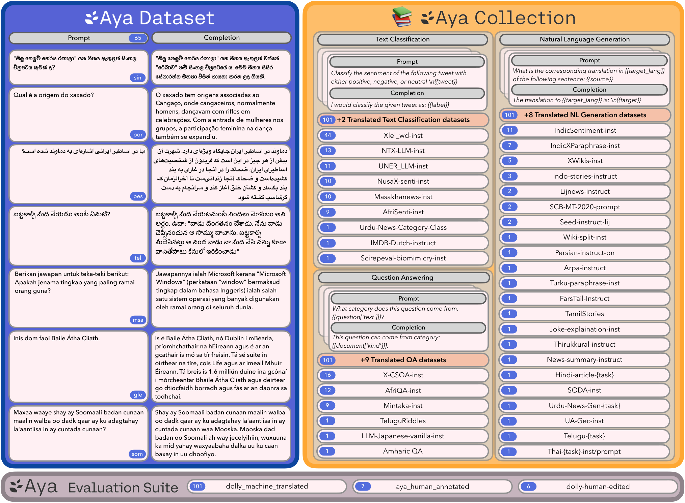
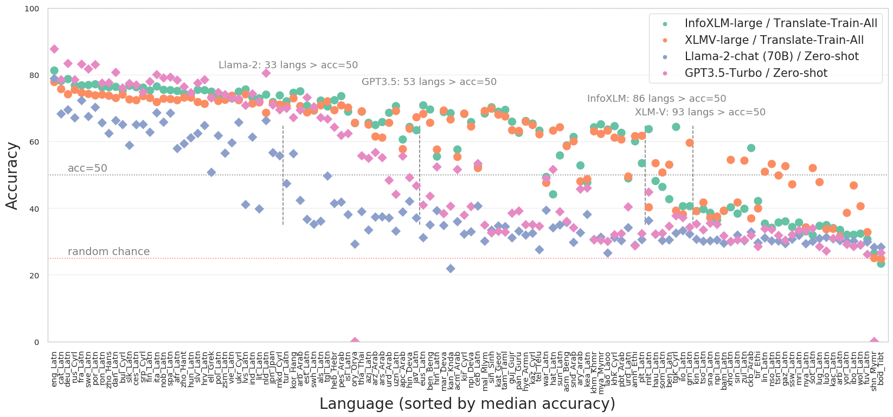

# 4. Available Datasets and Evaluation Tasks

Catalog of multilingual training corpora, instruction datasets, and evaluation benchmarks (RQ3, RQ4), with known pitfalls. Method context is in [document 3](3_contexts_methodologies.md).

## 4.1 Pretraining corpora

| Corpus | Size / coverage | Notes | Reference |
|---|---|---|---|
| mC4 | 101 languages, CommonCrawl | Basis of mT5; noisy for low-resource tails | [arXiv:2010.11934](https://arxiv.org/abs/2010.11934) |
| ROOTS | 1.6TB, 46 natural + 13 programming languages | BLOOM pretraining corpus; documented governance | [arXiv:2303.03915](https://arxiv.org/abs/2303.03915) |
| CulturaX | 6.3T tokens, 167 languages | Cleaned + deduplicated merge of mC4 and OSCAR | [arXiv:2309.09400](https://arxiv.org/abs/2309.09400) |
| MADLAD-400 | 3T tokens, 419 languages | Manually audited; documents audit limitations | [arXiv:2309.04662](https://arxiv.org/abs/2309.04662) |
| Glot500 corpus | 500+ languages | Tail-language coverage; paired with Glot500-m model | [arXiv:2305.12182](https://arxiv.org/abs/2305.12182) |
| FineWeb2 | 1000+ languages processed, 9 ablated | Per-language adaptive filtering/dedup pipeline; outperforms prior non-English corpora; rebalancing by duplication and quality | [arXiv:2506.20920](https://arxiv.org/abs/2506.20920) |
| MMedC | 25.5B tokens, 6 languages, medical | Domain CPT corpus for medicine | [arXiv:2402.13963](https://arxiv.org/abs/2402.13963) |

Parallel data: NLLB provides mined and human bitext for 200+ languages and the FLORES-200 evaluation set (NLLB Team, 2022, [arXiv:2207.04672](https://arxiv.org/abs/2207.04672)). Useful for QAlign-style question alignment and for parallel-corpus CPT (Swallow found parallel data helps translation abilities specifically).

Selection guidance: for low-resource CPT, start from FineWeb2 or MADLAD-400 for raw text, check per-language audit notes (MADLAD documents quality caveats per language), and deduplicate against evaluation sets to control contamination.

## 4.2 Instruction and preference datasets

| Dataset | Coverage | Construction | Reference |
|---|---|---|---|
| xP3 / xP3mt | 46 languages, 16 task types | English prompts over multilingual data; mt variant machine-translates prompts | [arXiv:2211.01786](https://arxiv.org/abs/2211.01786) |
| Aya Dataset | 65 languages, 204K instances | Human-written by fluent speakers (participatory) | [arXiv:2402.06619](https://arxiv.org/abs/2402.06619) |
| Aya Collection | 114 languages, 513M instances | Templating plus translation of existing datasets | [arXiv:2402.06619](https://arxiv.org/abs/2402.06619) |
| Bactrian-X | 52 languages, 3.4M pairs | Machine-translated Alpaca/Dolly instructions, ChatGPT responses | [arXiv:2305.15011](https://arxiv.org/abs/2305.15011) |
| Okapi RLHF data | 26 languages | Translated instructions plus ranking data for RLHF | [arXiv:2307.16039](https://arxiv.org/abs/2307.16039) |
| MGSM8KInstruct / MSVAMP | 10 languages, math CoT | Translate-train CoT corpus and OOD test set (MathOctopus) | [arXiv:2310.20246](https://arxiv.org/abs/2310.20246) |
| X-English parallel questions (QAlign) | 10+ languages | Question-only translation pairs for alignment stage | [arXiv:2401.07817](https://arxiv.org/abs/2401.07817) |

*Figure: Aya initiative coverage of instruction data across languages. Source: Singh et al., 2024, arXiv:2402.06619, Figure 1.*

Notes:

- Human-written (Aya Dataset) versus translated (Aya Collection, Bactrian-X) instruction data differ in translationese and cultural grounding; mixing both is common practice (Aya model recipe).
- xP3's key experimental finding transfers to dataset choice: English-prompt multitask data already transfers tasks across languages; machine-translated prompts help specifically for human-written non-English prompts at test time.
- For preference tuning in native languages, no large human preference corpus exists below high-resource languages; MAPO ([arXiv:2401.06838](https://arxiv.org/abs/2401.06838)) and language-imbalance rewarding ([arXiv:2410.08964](https://arxiv.org/abs/2410.08964)) construct preferences synthetically from cross-lingual consistency, which is currently the practical route.

## 4.3 Evaluation benchmarks by task family

### 4.3.1 General knowledge and exams

| Benchmark | Languages | Type | Reference |
|---|---|---|---|
| Global MMLU | 42 | Translated MMLU, professionally verified, tagged culturally-sensitive vs agnostic | [arXiv:2412.03304](https://arxiv.org/abs/2412.03304) |
| MMLU-ProX | 29 | Parallel translation of MMLU-Pro, expert-reviewed | [arXiv:2503.10497](https://arxiv.org/abs/2503.10497) |
| CMMLU | Chinese | Native Chinese multitask knowledge | [arXiv:2306.09212](https://arxiv.org/abs/2306.09212) |
| C-Eval | Chinese | Native Chinese exams, 52 disciplines, 4 difficulty levels | [arXiv:2305.08322](https://arxiv.org/abs/2305.08322) |
| M3Exam | 9 | Native official human exams, multimodal, 3 school levels | [arXiv:2306.05179](https://arxiv.org/abs/2306.05179) |
| INCLUDE | 44 | Native regional exam sources, 197K QA pairs | [arXiv:2411.19799](https://arxiv.org/abs/2411.19799) |
| IrokoBench | 16 African | AfriMGSM, AfriMMLU, AfriXNLI (human-translated) | [arXiv:2406.03368](https://arxiv.org/abs/2406.03368) |
| Belebele | 122 variants | Parallel MRC over FLORES passages; high/mid/low resource comparison | [arXiv:2308.16884](https://arxiv.org/abs/2308.16884) |

*Figure: model comparison on Belebele across language variants; English-centric LLMs transfer but balanced multilingual MLMs cover far more languages. Source: Bandarkar et al., 2023, arXiv:2308.16884.*

### 4.3.2 Classic cross-lingual NLU (encoder-era suites, still used)

| Benchmark | Languages | Task | Reference |
|---|---|---|---|
| XNLI | 15 | NLI | [arXiv:1809.05053](https://arxiv.org/abs/1809.05053) |
| XQuAD | 11 | Extractive QA | [arXiv:1910.11856](https://arxiv.org/abs/1910.11856) |
| TyDiQA | 11 typologically diverse | Info-seeking QA, natively written (no translation) | [arXiv:2003.05002](https://arxiv.org/abs/2003.05002) |
| XCOPA | 11 | Causal commonsense | [arXiv:2005.00333](https://arxiv.org/abs/2005.00333) |
| XTREME | 40 | Aggregated 9-task transfer suite | [arXiv:2003.11080](https://arxiv.org/abs/2003.11080) |

### 4.3.3 Math and reasoning

| Benchmark | Languages | Notes | Reference |
|---|---|---|---|
| MGSM | 11 | 250 GSM8K problems, human-translated | [arXiv:2210.03057](https://arxiv.org/abs/2210.03057) |
| MSVAMP | 10 | Out-of-domain multilingual math test | [arXiv:2310.20246](https://arxiv.org/abs/2310.20246) |
| OlympiadBench | EN/ZH | Olympiad math+physics, multimodal | [arXiv:2402.14008](https://arxiv.org/abs/2402.14008) |
| AfriMGSM (IrokoBench) | 16 African | Low-resource math reasoning | [arXiv:2406.03368](https://arxiv.org/abs/2406.03368) |

### 4.3.4 Code

| Benchmark | Coverage | Notes | Reference |
|---|---|---|---|
| MultiPL-E | 18+ programming languages | HumanEval/MBPP translated to PLs; English NL prompts | [arXiv:2208.08227](https://arxiv.org/abs/2208.08227) |
| HumanEval-XL | 23 NLs x 12 PLs, 22,080 prompts | Isolates natural-language axis of code generation | [arXiv:2402.16694](https://arxiv.org/abs/2402.16694) |

### 4.3.5 Medicine

| Benchmark | Languages | Notes | Reference |
|---|---|---|---|
| MMedBench | 6 | Medical MCQA with rationales | [arXiv:2402.13963](https://arxiv.org/abs/2402.13963) |
| XlingEval | 4 | Healthcare queries: correctness, consistency, verifiability | [arXiv:2310.13132](https://arxiv.org/abs/2310.13132) |

### 4.3.6 Open-ended generation and instruction following

| Benchmark | Languages | Notes | Reference |
|---|---|---|---|
| MEGA | 16 datasets, 70 languages | First broad generative-LLM multilingual eval | [arXiv:2303.12528](https://arxiv.org/abs/2303.12528) |
| BenchMAX | 17 | Instruction following, reasoning, code, long-context, translation | [arXiv:2502.07346](https://arxiv.org/abs/2502.07346) |
| Aya Evaluation Suite | 101 | Open-ended generation, human+LLM judged | [arXiv:2402.06619](https://arxiv.org/abs/2402.06619) |
| X-AlpacaEval | 4 (zh, ko, it, es) | Professional-translator instruction set for LLM-judge eval | [arXiv:2311.08711](https://arxiv.org/abs/2311.08711) |

### 4.3.7 Machine translation

| Benchmark | Languages | Notes | Reference |
|---|---|---|---|
| FLORES-200 | 200+ | Many-to-many MT eval, basis for Belebele passages | [arXiv:2207.04672](https://arxiv.org/abs/2207.04672) |

## 4.4 Known pitfalls (RQ4)

1. **Translation artifacts.** Machine-translated benchmarks measure MT quality as much as model quality; Global MMLU documents meaning distortion from translation and uses professional verification. Prefer natively sourced sets (TyDiQA, M3Exam, INCLUDE, CMMLU, C-Eval) when measuring native capability, and parallel translated sets (MGSM, MMLU-ProX, Belebele) when measuring cross-language deltas on identical content.
2. **Cultural confound.** 28% of MMLU requires culturally sensitive knowledge and 84.9% of geography questions are Western-centric (Global MMLU); a model can fail in a language for knowledge reasons, not linguistic ones. Report culturally-agnostic subsets separately.
3. **Contamination.** GSM8K and MMLU derivatives are heavily contaminated in modern pretraining corpora; translated versions inherit the contamination asymmetrically (English seen, translation unseen), which can inflate the apparent language gap. Deduplicate CPT corpora against benchmarks.
4. **Resource-level stratification.** Belebele's high/mid/low resource split and IrokoBench show aggregate multilingual scores hide the low-resource tail; always report per-resource-band results.
5. **Judge bias in generative eval.** LLM-as-judge benchmarks (X-AlpacaEval, Aya eval) use judges that are themselves English-centric; PLUG and Aya mitigate with professional translators and human raters. Treat LLM-judge multilingual win rates as noisy.
6. **Physics gap.** Outside OlympiadBench (EN/ZH) and exam subsets, there is no dedicated multilingual physics benchmark; results in section 1.3.5 rest on thin coverage.

## 4.5 Suggested evaluation matrix for this project

For a native preference tuning experiment on a low-resource target language L:

| Axis | Benchmark | Rationale |
|---|---|---|
| Reasoning delta vs English | MGSM (or AfriMGSM if L is covered), MSVAMP | Parallel content, isolates language effect |
| Knowledge, native | INCLUDE / M3Exam subset for L, else Global MMLU culturally-agnostic split | Avoids cultural confound |
| Reading comprehension | Belebele (L variant) | Covers 122 variants, likely includes L |
| Instruction following | Aya Evaluation Suite or X-AlpacaEval-style set in L | Generative quality |
| Code | HumanEval-XL with L prompts | NL axis at fixed PL |
| Regression check (English) | GSM8K, MMLU, AlpacaEval | Detect forgetting from finetuning |
| No-training baselines | direct, self-translate, XLT prompting | Anchored finetuning must beat prompt-level anchors |

## References

- Xue et al., 2020. mT5: A massively multilingual pre-trained text-to-text transformer. NAACL 2021. [arXiv:2010.11934](https://arxiv.org/abs/2010.11934)
- Laurençon et al., 2023. The BigScience ROOTS Corpus. NeurIPS 2022 Datasets and Benchmarks. [arXiv:2303.03915](https://arxiv.org/abs/2303.03915)
- Nguyen et al., 2023. CulturaX: A Cleaned, Enormous, and Multilingual Dataset for LLMs in 167 Languages. LREC-COLING 2024. [arXiv:2309.09400](https://arxiv.org/abs/2309.09400)
- Kudugunta et al., 2023. MADLAD-400: A Multilingual And Document-Level Large Audited Dataset. NeurIPS 2023 Datasets and Benchmarks. [arXiv:2309.04662](https://arxiv.org/abs/2309.04662)
- Imani et al., 2023. Glot500: Scaling Multilingual Corpora and Language Models to 500 Languages. ACL 2023. [arXiv:2305.12182](https://arxiv.org/abs/2305.12182)
- Penedo et al., 2025. FineWeb2: One Pipeline to Scale Them All. [arXiv:2506.20920](https://arxiv.org/abs/2506.20920)
- Qiu et al., 2024. Towards Building Multilingual Language Model for Medicine (MMedC, MMedBench). [arXiv:2402.13963](https://arxiv.org/abs/2402.13963)
- NLLB Team, 2022. No Language Left Behind (FLORES-200). [arXiv:2207.04672](https://arxiv.org/abs/2207.04672)
- Muennighoff et al., 2022. Crosslingual Generalization through Multitask Finetuning (xP3). ACL 2023. [arXiv:2211.01786](https://arxiv.org/abs/2211.01786)
- Singh et al., 2024. Aya Dataset: An Open-Access Collection for Multilingual Instruction Tuning. ACL 2024. [arXiv:2402.06619](https://arxiv.org/abs/2402.06619)
- Li et al., 2023. Bactrian-X. [arXiv:2305.15011](https://arxiv.org/abs/2305.15011)
- Lai et al., 2023. Okapi. EMNLP 2023 demo. [arXiv:2307.16039](https://arxiv.org/abs/2307.16039)
- Chen et al., 2023. MathOctopus (MGSM8KInstruct, MSVAMP). [arXiv:2310.20246](https://arxiv.org/abs/2310.20246)
- Zhu et al., 2024. Question Translation Training (QAlign). ACL 2024 Findings. [arXiv:2401.07817](https://arxiv.org/abs/2401.07817)
- She et al., 2024. MAPO. ACL 2024. [arXiv:2401.06838](https://arxiv.org/abs/2401.06838)
- Yang et al., 2024. Language Imbalance Driven Rewarding. ICLR 2025. [arXiv:2410.08964](https://arxiv.org/abs/2410.08964)
- Singh et al., 2024. Global MMLU. [arXiv:2412.03304](https://arxiv.org/abs/2412.03304)
- Xuan et al., 2025. MMLU-ProX. [arXiv:2503.10497](https://arxiv.org/abs/2503.10497)
- Li et al., 2023. CMMLU. ACL 2024 Findings. [arXiv:2306.09212](https://arxiv.org/abs/2306.09212)
- Huang et al., 2023. C-Eval. NeurIPS 2023 Datasets and Benchmarks. [arXiv:2305.08322](https://arxiv.org/abs/2305.08322)
- Zhang et al., 2023. M3Exam. NeurIPS 2023 Datasets and Benchmarks. [arXiv:2306.05179](https://arxiv.org/abs/2306.05179)
- Romanou et al., 2024. INCLUDE. ICLR 2025. [arXiv:2411.19799](https://arxiv.org/abs/2411.19799)
- Adelani et al., 2024. IrokoBench. [arXiv:2406.03368](https://arxiv.org/abs/2406.03368)
- Bandarkar et al., 2023. The Belebele Benchmark. ACL 2024. [arXiv:2308.16884](https://arxiv.org/abs/2308.16884)
- Conneau et al., 2018. XNLI. EMNLP 2018. [arXiv:1809.05053](https://arxiv.org/abs/1809.05053)
- Artetxe et al., 2019. XQuAD. ACL 2020. [arXiv:1910.11856](https://arxiv.org/abs/1910.11856)
- Clark et al., 2020. TyDi QA. TACL 2020. [arXiv:2003.05002](https://arxiv.org/abs/2003.05002)
- Ponti et al., 2020. XCOPA. EMNLP 2020. [arXiv:2005.00333](https://arxiv.org/abs/2005.00333)
- Hu et al., 2020. XTREME. ICML 2020. [arXiv:2003.11080](https://arxiv.org/abs/2003.11080)
- Shi et al., 2022. MGSM. ICLR 2023. [arXiv:2210.03057](https://arxiv.org/abs/2210.03057)
- He et al., 2024. OlympiadBench. ACL 2024. [arXiv:2402.14008](https://arxiv.org/abs/2402.14008)
- Cassano et al., 2022. MultiPL-E. IEEE TSE 2023. [arXiv:2208.08227](https://arxiv.org/abs/2208.08227)
- Peng et al., 2024. HumanEval-XL. LREC-COLING 2024. [arXiv:2402.16694](https://arxiv.org/abs/2402.16694)
- Jin et al., 2023. Better to Ask in English (XlingEval). WWW 2024. [arXiv:2310.13132](https://arxiv.org/abs/2310.13132)
- Ahuja et al., 2023. MEGA. EMNLP 2023. [arXiv:2303.12528](https://arxiv.org/abs/2303.12528)
- Huang et al., 2025. BenchMAX. [arXiv:2502.07346](https://arxiv.org/abs/2502.07346)
- Zhang et al., 2023. PLUG (X-AlpacaEval). [arXiv:2311.08711](https://arxiv.org/abs/2311.08711)
