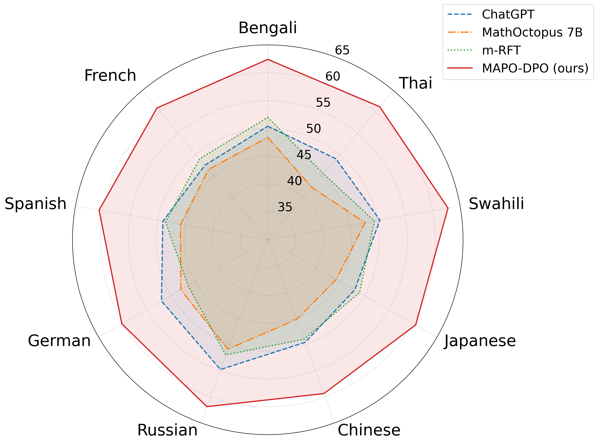
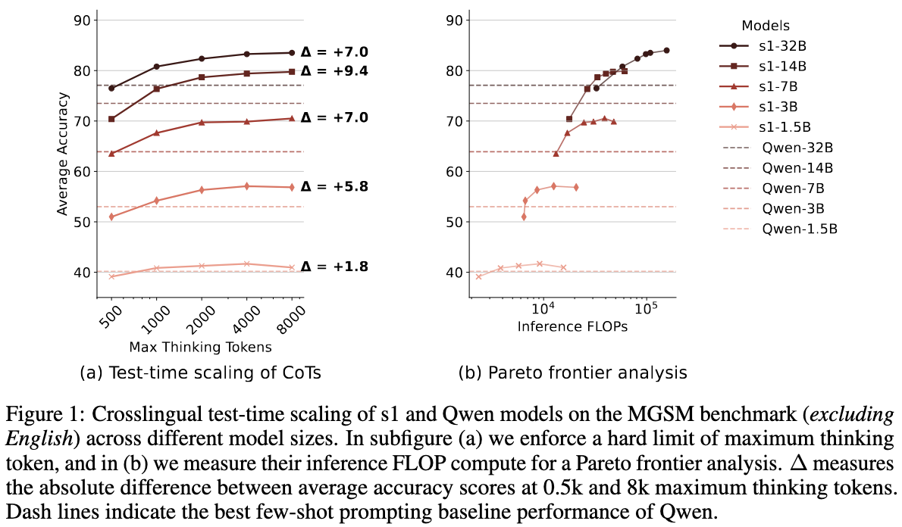
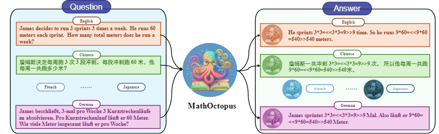
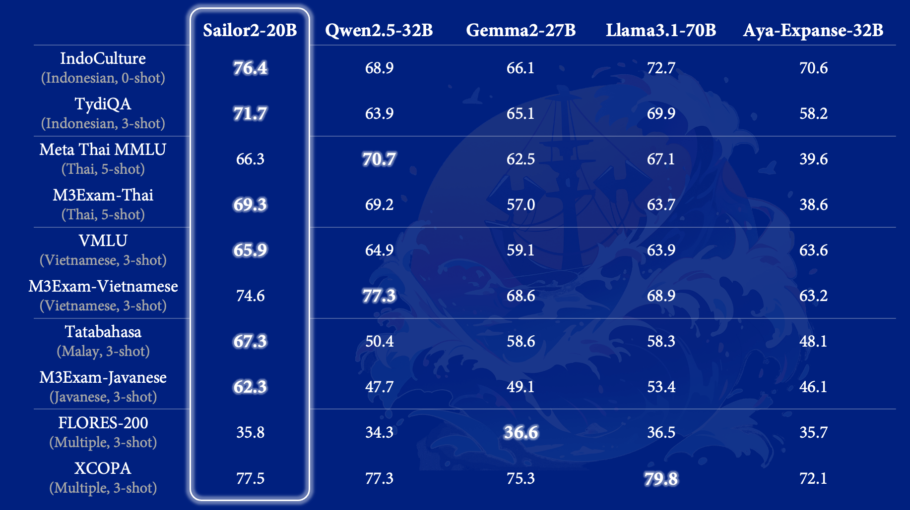
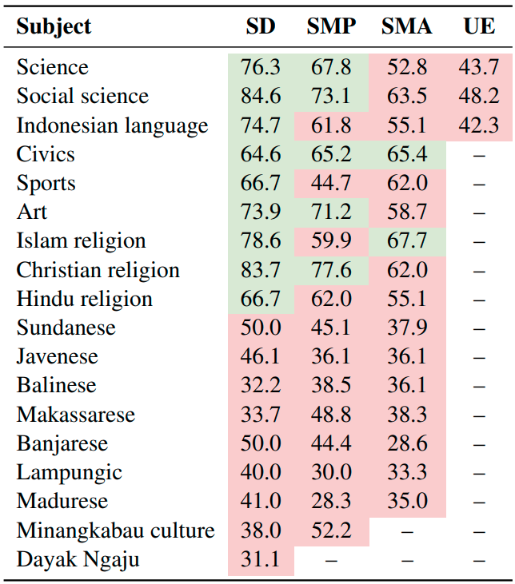
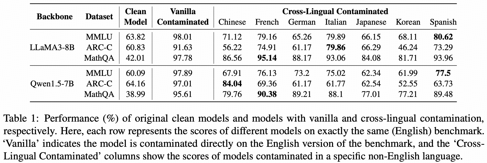

# 5. Language as the Medium of Finetuning and Evaluation

Literature note supporting the design in [docs/methodology.md](../methodology.md). It asks whether the language used to finetune and evaluate a model changes task accuracy when everything else is held fixed, what drives the differences that are measured, what is known about the Indonesian languages in this study, and how the measurement itself can go wrong. Documents 1 to 4 cover the wider background (degradation by domain, internals, adaptation methods, datasets); this note adds the 2024 to 2026 work on the language of reasoning, the controlled same-data comparisons, the linguistics and resources of the target languages, translation quality assessment, and evaluation statistics.

Method note. arXiv, the ACL Anthology and the Hugging Face Hub were unreachable from the environment in which this note was compiled. Identifiers were taken verbatim from official repositories, technical reports downloaded from GitHub, and search results, and cross-checked against a second source where one existed. Numbers are quoted only where they were read from a primary or official source; numbers taken from third-party digests are marked as such. The appendix lists identifiers that could not be confirmed against a second source.

Companion documents:

- [1. Introduction and Problem Statements](1_intro_problem_statements.md)
- [2. Preliminaries and Fundamentals](2_preliminaries_fundamentals.md)
- [3. Contexts and Available Methodologies](3_contexts_methodologies.md)
- [4. Available Datasets and Evaluation Tasks](4_datasets_evaluation.md)

## 5.1 Does the language of reasoning, prompting or training change accuracy?

### 5.1.1 Prompt-level anchoring

MGSM (Shi et al., 2022, [arXiv:2210.03057](https://arxiv.org/abs/2210.03057)) compared reasoning in the question's language, reasoning in English about a non-English question, and translating the question to English first. For under-represented languages the English settings recovered part of the gap; for high-resource languages the settings were close. Cross-lingual-thought prompting (Huang et al., 2023, [arXiv:2305.07004](https://arxiv.org/abs/2305.07004)) asks the model to restate the problem in English before solving and reports gains of over ten points on average on arithmetic reasoning and open-domain question answering; much of the zero-shot delta is answer-format recovery rather than reasoning. Self-translation (Etxaniz et al., 2023, [arXiv:2308.01223](https://arxiv.org/abs/2308.01223)) uses the model's own few-shot translation and outperforms direct inference consistently; the authors note the gap is larger for more capable models, which means low-resource languages gain less because the model cannot translate them well either. Whether translating to English is universally optimal is task dependent: native prompting wins on culture-bound tasks ([arXiv:2403.10258](https://arxiv.org/abs/2403.10258)).

### 5.1.2 Anchoring during instruction tuning

PLUG (Zhang et al., 2023, [arXiv:2311.08711](https://arxiv.org/abs/2311.08711)) trains the model to process the instruction in English before answering in the target language and reports a 29 percent average improvement in instruction following over direct target-language training. Question alignment (Zhu et al., 2024, [arXiv:2401.07817](https://arxiv.org/abs/2401.07817)) adds a stage that aligns target-language questions to English and then trains on English reasoning data only; it beats translate-training by 11.3 and 16.1 points on MGSM and MSVAMP for a 13B model, and its authors describe translated chain-of-thought data as noisy because of the non-standard formatting of mathematical reasoning. Understand-solve-translate (Kim et al., 2025, [arXiv:2501.02448](https://arxiv.org/abs/2501.02448)) finds that the multilingual gap on Korean math stems primarily from comprehension of the non-English input rather than from reasoning, and closes most of it with synthetic training data. MAPO (She et al., 2024, [arXiv:2401.06838](https://arxiv.org/abs/2401.06838)) turns consistency between non-English and English reasoning into a preference signal.

*Figure 5.1. Answer consistency ratio between non-English and English reasoning across ten languages for several models; preference optimization toward the English trace raises consistency. Source: She et al., 2024, arXiv:2401.06838, repository figure.*

### 5.1.3 Reasoning models and the language of thought

Work from 2025 and 2026 on long chain-of-thought models repeats the pattern at larger scale and adds mechanism. Fine-tuning on translated reasoning traces for French, Japanese, Latvian and Swahili (Berkeley-NLP, [arXiv:2508.14828](https://arxiv.org/abs/2508.14828)) finds that native reasoning is on par with English for high-resource languages, that mid-resource languages gain from English pivoting, and that the lowest-resource language gains little from either because comprehension and reasoning are both weak. Reasoning models revert to English or produce fragmented traces when forced to think in other languages, and forcing the user's language improves oversight but reduces accuracy ([arXiv:2505.22888](https://arxiv.org/abs/2505.22888); [arXiv:2505.17407](https://arxiv.org/abs/2505.17407)). English traces show more of the behaviours associated with successful reasoning, and the advantage grows with task complexity ([arXiv:2510.20647](https://arxiv.org/abs/2510.20647)). Across Qwen3 sizes and gpt-oss, understanding failures are the dominant source of the multilingual reasoning gap ([arXiv:2510.27269](https://arxiv.org/abs/2510.27269)), although controlling the reasoning language changes accuracy even for English questions, so execution is language-sensitive too ([arXiv:2605.27715](https://arxiv.org/abs/2605.27715)).

*Figure 5.2. Average non-English MGSM accuracy of English-centric reasoning models rises with the thinking-token budget. Source: Yong et al., 2025, arXiv:2505.05408, Figure 1.*

Test-time scaling in English-centric reasoning models lifts multilingual math, with relative gains reported for French and Swahili, and the authors recommend letting such models reason in high-resource languages ([arXiv:2505.05408](https://arxiv.org/abs/2505.05408)). The most controlled comparison to date trains native and English-pivoted specialists from the same base on matched long-reasoning data in six languages and finds the native penalty far smaller than earlier reports, about 2.7 to 3.5 points, largest for Swahili, and largely removable by swapping mid-stack layers from the English specialist ([arXiv:2605.26735](https://arxiv.org/abs/2605.26735)). The interpretation is a largely language-agnostic reasoning core in the middle layers, consistent with the latent-English and semantic-hub accounts in document 2, and with the finding that ablating language-specific representations at inference improves multilingual reasoning ([arXiv:2505.15257](https://arxiv.org/abs/2505.15257)). The latent-language claim itself is contested at the measurement level, since different probes disagree ([arXiv:2609.00155](https://arxiv.org/abs/2609.00155)), and it depends on the pretraining mix: models with substantial Japanese continued pretraining develop a second latent language ([arXiv:2408.10811](https://arxiv.org/abs/2408.10811)).

Two measurement results matter directly for this study. Output-token caps can swing the measured native-versus-English gap by tens of points and reverse rankings at tight caps ([arXiv:2608.04160](https://arxiv.org/abs/2608.04160)). Translation errors in the benchmark itself distort cross-language comparisons, which motivated corrected versions of MGSM ([arXiv:2511.05162](https://arxiv.org/abs/2511.05162); [arXiv:2605.24904](https://arxiv.org/abs/2605.24904)), and re-instantiating the digits in math items reveals large drops for low-resource languages ([arXiv:2601.21225](https://arxiv.org/abs/2601.21225)).

### 5.1.4 Same data, different languages

Translate-training studies that hold the content fixed and vary the language of the tuning data are the closest analogues to this study's design.

*Figure 5.3. The translate-train recipe of MathOctopus: GSM8K translated into ten languages, one model answering in the language of the question. Source: Chen et al., 2023, arXiv:2310.20246, repository figure.*

MathOctopus (Chen et al., 2023, [arXiv:2310.20246](https://arxiv.org/abs/2310.20246)) translated GSM8K into ten languages and found that monolingual finetuning in a non-English language is consistently outperformed by multilingual finetuning evaluated in that same language, and that multilingual tuning also lifts English. Monolingual-versus-multilingual Alpaca ([arXiv:2309.08958](https://arxiv.org/abs/2309.08958)) reaches the same conclusion under a fixed budget. A study of 220 supervised finetuning runs on parallel mixtures ([arXiv:2604.13286](https://arxiv.org/abs/2604.13286)) reports that more language coverage helps, that low-resource languages benefit most, and that bilingual beats English-only on math. Lucky 52 ([arXiv:2404.04850](https://arxiv.org/abs/2404.04850)) trained one model per language count from 1 to 52 on Bactrian-X and found that genetic relatedness predicts transfer better than the number of languages, which is relevant because every language in this study is Malayo-Polynesian. A pinch of multilinguality ([arXiv:2401.01854](https://arxiv.org/abs/2401.01854)) and the polyglot study ([arXiv:2312.12683](https://arxiv.org/abs/2312.12683)) show that very little non-English tuning data unlocks instruction following, and that pretraining exposure bounds what tuning can reach. The language-ranking result ([arXiv:2404.11553](https://arxiv.org/abs/2404.11553)) makes the bound explicit: per-language performance correlates strongly with the language's share of the pretraining corpus.

Preference signals also transfer across languages: English reward models beat target-language reward models on a multilingual reward benchmark ([arXiv:2410.18027](https://arxiv.org/abs/2410.18027)), implicit cross-lingual rewarding labels multilingual pairs with an English preference model ([arXiv:2503.04647](https://arxiv.org/abs/2503.04647)), and multilingual preference training benefits from cross-lingual transfer ([arXiv:2407.02552](https://arxiv.org/abs/2407.02552)).

### 5.1.5 Token efficiency and the "Chinese is cheaper" claim

Forcing reasoning into another language can reduce tokens while preserving accuracy for models with strong multilingual foundations ([arXiv:2507.00246](https://arxiv.org/abs/2507.00246)), but a software-engineering study finds no consistent Chinese token advantage and lower success rates in Chinese ([arXiv:2604.14210](https://arxiv.org/abs/2604.14210)). Token counts across languages are dominated by the tokenizer: the same text differs by up to 15 times in token length across languages ([arXiv:2305.15425](https://arxiv.org/abs/2305.15425)), and the Komodo report gives Llama-2 fertility of 2.858 for Indonesian against 1.666 for English before vocabulary extension ([arXiv:2403.09362](https://arxiv.org/abs/2403.09362)). Any efficiency story is a tokenizer story, not a property of the language as a reasoning medium.

### 5.1.6 What this predicts for the study

Accuracy after native tuning should be ordered by exposure, en >= id > jv, su > min, ace, with the gap largest on multi-step math and smallest on option-letter tasks. With matched data on a strong base the native penalty may be a few points; with thin exposure it may be tens of points. Pooled tuning should beat native tuning even on the target's own test set. Nothing in the literature supports a language being an intrinsically better medium; the ordering is attributable to exposure, tokenization, translation quality and comprehension failures.

## 5.2 Is any language intrinsically harder or less expressive?

### 5.2.1 Language-modeling difficulty

Cotterell et al. (2018, [arXiv:1806.03743](https://arxiv.org/abs/1806.03743)) found cross-language differences in surprisal on parallel Europarl text and attributed them to inflectional morphology. Mielke et al. (2019, [arXiv:1906.04726](https://arxiv.org/abs/1906.04726)) scaled to 69 languages, failed to reproduce the morphology effect, and found that simple statistics such as the number of word types and characters per word predict difficulty. Park et al. (2021, [arXiv:2012.06262](https://arxiv.org/abs/2012.06262)) brought morphology back as a predictor, but only under subword segmentation. A 2026 survey organized around exactly this question concludes that gaps often shrink when segmentation, encoding and data exposure are normalized, so that much apparent difficulty stems from modeling choices ([arXiv:2601.07220](https://arxiv.org/abs/2601.07220)). On the human side, spoken languages converge on a similar information rate despite very different per-syllable density (Coupé et al., 2019, Science Advances, [doi:10.1126/sciadv.aaw2594](https://www.science.org/doi/10.1126/sciadv.aaw2594)). None of this supports the idea that a natural language is a low-capacity medium.

### 5.2.2 Tokenizers

A dedicated monolingual tokenizer matters about as much as pretraining data size for downstream performance ([arXiv:2012.15613](https://arxiv.org/abs/2012.15613)). Commercial tokenizers overcharge speakers of many languages while returning poorer results ([arXiv:2305.13707](https://arxiv.org/abs/2305.13707)). Syllable-based tokenization for Austronesian languages yields uniform tokens per character across the NusaX languages, whereas an English-trained BPE fragments the regional languages more and unevenly ([arXiv:2602.06998](https://arxiv.org/abs/2602.06998); [arXiv:2601.11643](https://arxiv.org/abs/2601.11643)). No publication reports fertility or bits per character for Javanese, Sundanese, Minangkabau or Acehnese under the Llama 3, Gemma 3 or Qwen 3 tokenizers; Phase 0 of the methodology produces that table.

### 5.2.3 The Indonesian premise

Indonesian is a standardized variety of Malay. Its official dictionary held about 120,000 entries at the 2023 launch of its sixth edition with a stated target of 200,000 lemmas, several times fewer than large English dictionaries, but dictionary counts follow codification effort and counting conventions, and Indonesian's derivational morphology (meN-, ber-, di-, ter-, peN-, -kan, -i, ke-an, peN-an, productive reduplication) multiplies each lemma into many surface forms, which is what a tokenizer sees. "Simple grammar" is defensible for colloquial Indonesian: Gil's work on Riau Indonesian argues it is as simple as a creole by the usual criteria (no noun-verb distinction, no tense or definiteness marking). The standard written register used in benchmarks and in training data is affix-rich, and it is the register the translations in this study use. The premise is therefore re-cast as measurable quantities: characters per item, tokens per item, bits per byte, and the position of Indonesian relative to what its exposure predicts.

### 5.2.4 The target languages

| Language | Speakers (Ethnologue via NusaX) | Family and branch | Relation to Indonesian | Registers | Script in practice | FLORES-200 |
|---|---|---|---|---|---|---|
| Indonesian | about 250M total, first-language count contested | Malayic (standardized Malay) | identity | formal and colloquial diglossia | Latin | ind_Latn |
| Javanese | 84M | own branch of Malayo-Polynesian | distant genetically, heavy mutual borrowing | ngoko, madya, krama | Latin (Aksara Jawa marginal) | jav_Latn |
| Sundanese | 34M | Malayo-Sumbawan, own branch | moderate; shared affix system | kasar, loma, lemes | Latin | sun_Latn |
| Minangkabau | 6M | Malayic | 75 percent lexical similarity; 54.9 percent of dictionary entries identical (Koto and Koto, 2020, [arXiv:2009.09309](https://arxiv.org/abs/2009.09309)) | standard | Latin (min_Arab exists) | min_Latn |
| Acehnese | 4M | Chamic | closest relatives in Vietnam and Cambodia; lexically opaque to Indonesian speakers | standard | Latin, 31 letters | ace_Latn |
| Balinese | 3M | Bali-Sasak-Sumbawa | moderate to low | alus, madia, kasar | Latin | ban_Latn |
| Banjar | 4M | Malayic | high (figure not verified) | standard | Latin | bjn_Latn |
| Buginese | 6M | South Sulawesi | lowest; person marking on verbs | standard | Latin (Lontara historical) | bug_Latn |
| Madurese | 7M (other sources higher) | Malayo-Sumbawan, own branch | low to moderate | speech levels | Latin | not covered |

Speech levels matter for the design: language models struggle with most Javanese honorific levels and are biased toward particular tiers ([arXiv:2502.20864](https://arxiv.org/abs/2502.20864)), and the krama register scores substantially worse than ngoko on a multi-task benchmark ([arXiv:2508.12459](https://arxiv.org/abs/2508.12459)). Native scripts are near zero for current models ([arXiv:2502.18148](https://arxiv.org/abs/2502.18148)), which is why every dataset in this study is Latin.

## 5.3 Prior work that asked the same question

No prior paper runs the design proposed here (same base model, same items, same translator, same finetuning recipe, crossed over English, Indonesian and four regional languages, with exposure and translation quality as covariates). The closest crossed designs vary only the language of tuning data for European and major Asian languages ([arXiv:2309.08958](https://arxiv.org/abs/2309.08958); [arXiv:2402.13703](https://arxiv.org/abs/2402.13703); [arXiv:2504.16677](https://arxiv.org/abs/2504.16677); [arXiv:2511.13368](https://arxiv.org/abs/2511.13368)) or include Indonesian for a single task ([arXiv:2504.19759](https://arxiv.org/abs/2504.19759)). Their consensus, some of it from third-party digests: the language of tuning data matters little for instruction following and much more for reasoning; under equal budget, pooled multilingual tuning is on par with or better than one model per language; and target-language identity, not source language, explains most transfer variance. For Indonesian regional languages specifically, zero-shot transfer studies find exposure the dominant predictor and subword fragmentation a weak one ([arXiv:2507.01645](https://arxiv.org/abs/2507.01645)); Cendol finds that instruction tuning on Indonesian generalizes to some extent to regional languages and that LoRA is insufficient for language adaptation ([arXiv:2404.06138](https://arxiv.org/abs/2404.06138)); LLM-generated in-language stories can beat machine-translated data for Javanese and Sundanese downstream ([arXiv:2502.12932](https://arxiv.org/abs/2502.12932)); and a MATH-style set in Indonesian, Javanese, Sundanese and Buginese shows substantial gaps for the low-resource languages (MATH-IDN, Findings of EACL 2026).

The novelty of this study is the design, not a method: a paired, pipeline-controlled comparison across closely related low-resource languages with the confounds measured, plus the published gated translations.

## 5.4 Base models and exposure

### 5.4.1 What the vendors document

Qwen3's technical report ([arXiv:2505.09388](https://arxiv.org/abs/2505.09388)) trains on 36 trillion tokens over 119 languages and dialects; its published language table names Indonesian, Malay, Javanese, Sundanese, Minangkabau, Balinese and Banjar, but not Acehnese, Buginese or Madurese, and its own per-language Belebele numbers cover only Indonesian, Javanese and Sundanese among the study languages, as a family average. Qwen3.5 claims 201 languages without a published list. Gemma 3 ([arXiv:2503.19786](https://arxiv.org/abs/2503.19786)) trains 4T tokens for the 4B model with explicit multilingual rebalancing and a 262k-entry tokenizer, and its model card claims over 140 languages without a list. Llama 3.2 officially supports eight languages, none Indonesian. Mistral 7B and gpt-oss publish no language list.

### 5.4.2 Corpus-side exposure

Web-corpus statistics upper-bound what any CommonCrawl-derived pretraining set could contain. MADLAD-400 clean characters ([arXiv:2309.04662](https://arxiv.org/abs/2309.04662), Table 9): Indonesian 148.3 billion, Javanese 376 million, Sundanese 287 million, Minangkabau 9.9 million, Acehnese 7.4 million, Balinese 3.6 million, Madurese 2.8 million. HPLT v3 cleaned words: Indonesian 86.4 billion, Javanese 134 million, Sundanese 92 million, Balinese 17 million, Minangkabau 12 million, Banjar 9.6 million, Acehnese 3.9 million, Buginese 1.2 million. Indonesian is roughly 400 to 650 times Javanese; Javanese is 30 to 50 times Minangkabau and Acehnese. Earlier counts tell the same story: CC-100 has 0.001 percent Javanese and 0.002 percent Sundanese ([arXiv:2203.13357](https://arxiv.org/abs/2203.13357)), and CulturaX has about 2,000 Javanese documents against 23 million Indonesian.

### 5.4.3 Southeast Asian and Indonesian models

*Figure 5.4. Base-model results for Sailor2-20B against general models on Southeast Asian benchmarks; the Javanese M3Exam column is one of the few published per-language numbers for a regional language. Source: Dou et al., 2025, arXiv:2502.12982, blog figure.*

Sailor2 ([arXiv:2502.12982](https://arxiv.org/abs/2502.12982)) is the only Southeast Asian model with Javanese and Sundanese in continued pretraining, at 0.17 and 0.09 billion stage-2 tokens against 94 billion Indonesian; SEA-LION v3 ([arXiv:2504.05747](https://arxiv.org/abs/2504.05747)) includes Javanese and Sundanese only through instruction data; Sahabat-AI adds 96,000 Javanese and 98,000 Sundanese instruction pairs on top of SEA-LION; Komodo-7B ([arXiv:2403.09362](https://arxiv.org/abs/2403.09362)) and Cendol ([arXiv:2404.06138](https://arxiv.org/abs/2404.06138)) cover Minangkabau, Acehnese, Balinese, Banjar, Buginese and Madurese on Llama-2-era bases. None of these is on the AutoScientist catalogue, so they serve as reference points, not as finetuning bases.

*Figure 5.5. GPT-3.5 accuracy on IndoMMLU by subject and level; every regional-language subject fails the Indonesian passing grade at every level. Source: Koto et al., 2023, arXiv:2310.04928, repository figure.*

### 5.4.4 Proxies

Exposure is reported per language and per base model through: the vendor language-list flag; corpus counts; tokenizer fertility on FLORES-200 devtest; bits per byte on FLORES-200 devtest (tokenizer-independent, paired with a held-out slice of the study's own items in case FLORES is in pretraining); and the language-identification rate of zero-shot generations. Fertility alone is not predictive of downstream performance ([arXiv:2310.08754](https://arxiv.org/abs/2310.08754)), which is why it is a covariate and not a selection criterion on its own.

## 5.5 Resources for Indonesian regional languages

Coverage is uneven. Indonesian has native evaluation sets for exams and science (IndoMMLU, 14,906 questions, [arXiv:2310.04928](https://arxiv.org/abs/2310.04928)), professional and healthcare exams (IndoCareer, 8,834 questions, [arXiv:2409.08564](https://arxiv.org/abs/2409.08564)), commonsense (COPAL-ID, [arXiv:2311.01012](https://arxiv.org/abs/2311.01012); IndoCulture, [arXiv:2404.01854](https://arxiv.org/abs/2404.01854)), plus Indonesian splits of Global MMLU, MMLU-ProX and HumanEval-XL. Javanese and Sundanese have Belebele (900 items each, [arXiv:2308.16884](https://arxiv.org/abs/2308.16884)), M3Exam for Javanese ([arXiv:2306.05179](https://arxiv.org/abs/2306.05179)), a story-cloze set, IndoSafety ([arXiv:2506.02573](https://arxiv.org/abs/2506.02573)) and SEA-HELM tasks ([arXiv:2502.14301](https://arxiv.org/abs/2502.14301)). Minangkabau, Acehnese, Balinese, Banjar, Buginese and Madurese have sentiment, emotion and translation data only: NusaX (1,000 parallel sentences per language, [arXiv:2205.15960](https://arxiv.org/abs/2205.15960)), NusaWrites ([arXiv:2309.10661](https://arxiv.org/abs/2309.10661)), MinangNLP (16,371 Minangkabau-Indonesian sentence pairs), FLORES-200 ([arXiv:2207.04672](https://arxiv.org/abs/2207.04672), all except Madurese). No language other than Indonesian has a native evaluation set for math, medicine, code or science, so every such item in this study is a project translation, triangulated against Belebele, M3Exam and NusaX as native controls.

Machine translation quality into the regional languages is the other resource limit. NLLB-200 chrF++ from English (metrics mirror, checkpoint not labelled): Indonesian 68.8, Javanese 54.4, Minangkabau 50.6, Banjar 47.7, Sundanese 46.2, Balinese 43.1, Acehnese 37.4, Buginese 33.4. NusaMT-7B improves into Balinese and Minangkabau by a few spBLEU points over NLLB ([arXiv:2410.07830](https://arxiv.org/abs/2410.07830)). An LLM translator should be expected to sit near or below these numbers for Acehnese and Buginese.

## 5.6 Translation quality assessment

Learned quality-estimation metrics split the target languages by encoder coverage. Javanese and Sundanese are in XLM-R's 100 languages and in mC4, so CometKiwi, xCOMET ([arXiv:2310.10482](https://arxiv.org/abs/2310.10482)) and MetricX-24 ([arXiv:2410.03983](https://arxiv.org/abs/2410.03983)) are inside coverage; Minangkabau and Acehnese are in neither, and the COMET authors state that results for uncovered languages are unreliable. NLLB-200 and FLORES-200 cover all four, so NLLB-200 is the only universal second translator and FLORES-200 devtest the only human anchor. GlotLID ([arXiv:2310.16248](https://arxiv.org/abs/2310.16248)) identifies all the study languages and warns that close relatives need higher confidence thresholds. LLM judges of translation quality (GEMBA, [arXiv:2302.14520](https://arxiv.org/abs/2302.14520), [arXiv:2310.13988](https://arxiv.org/abs/2310.13988)) are strong on high-resource pairs but overestimate quality for low-resource languages and flip preferences under language switching ([arXiv:2607.02235](https://arxiv.org/abs/2607.02235); [arXiv:2606.14278](https://arxiv.org/abs/2606.14278)). Unreviewed machine translation changes what a benchmark measures (Artetxe et al., 2020, [arXiv:2004.04721](https://arxiv.org/abs/2004.04721)); Global MMLU's inclusion rule was at least 50 human-verified samples per language ([arXiv:2412.03304](https://arxiv.org/abs/2412.03304)). Error-span annotation (WMT 2024) is the human protocol that native speakers who are not professional translators can learn quickly; MQM ([arXiv:2104.14478](https://arxiv.org/abs/2104.14478)) is the reference taxonomy. These facts fix the gate in methodology section 6.

## 5.7 Statistics of the comparison

*Figure 5.6. Continued pretraining on translated versions of a benchmark inflates scores on the English test set, so contamination crosses languages and text-overlap checks miss it. Source: Yao et al., 2024, arXiv:2406.13236, Table 1.*

Per-item scores on the same items across conditions are paired data; the reference for evaluation statistics is Miller (2024, [arXiv:2411.00640](https://arxiv.org/abs/2411.00640)), which the installed Inspect version implements as clustered standard errors and cluster bootstrap intervals. Normal-approximation intervals fail below a few hundred items ([arXiv:2503.01747](https://arxiv.org/abs/2503.01747)). The paired minimum detectable difference at 250 items is about 8 points and at 1,300 items about 3.5, which is why the full GSM8K test is translated (Card et al., 2020, [arXiv:2010.06595](https://arxiv.org/abs/2010.06595), for the power framing). Finetuning seed variance is often larger than the effects of interest ([arXiv:2002.06305](https://arxiv.org/abs/2002.06305); [arXiv:2503.07329](https://arxiv.org/abs/2503.07329); [arXiv:2504.07086](https://arxiv.org/abs/2504.07086)), and an automated hyperparameter optimizer is a nuisance source that must be blocked or randomized and averaged ([arXiv:2103.03098](https://arxiv.org/abs/2103.03098); [arXiv:1909.03004](https://arxiv.org/abs/1909.03004)). Multiple comparisons across datasets follow the replicability recipe of Dror et al. (2017, [arXiv:1709.09500](https://arxiv.org/abs/1709.09500)). Contamination crosses language barriers ([arXiv:2406.13236](https://arxiv.org/abs/2406.13236)), nearly all evaluated models show contamination on multilingual benchmarks ([arXiv:2410.16186](https://arxiv.org/abs/2410.16186)), and GSM8K-style items are among the most contaminated (GSM1k, [arXiv:2405.00332](https://arxiv.org/abs/2405.00332)); the detection toolbox includes n-gram overlap, perplexity-based checks ([arXiv:2404.18824](https://arxiv.org/abs/2404.18824)), Min-K% ([arXiv:2310.16789](https://arxiv.org/abs/2310.16789)) and option-replacement tests.

## 5.8 Tooling facts that shaped the design

From the installed packages (Inspect AI 0.3.262, inspect_evals 0.19.0, Adaption SDK 0.10.0): letter-choice scoring requires the literal `ANSWER:` marker; numeric matching treats the comma as a thousands separator and the period as the decimal point; the MGSM task ships eleven languages, none of them in this study; AutoScientist exposes sixteen hyperparameters, no seed, and returns only the best iteration's hyperparameters and win rate; hyperparameters can be pinned by copying the recommendation call's output; datasets can be uploaded raw so that no server-side augmentation touches the rows. The consequences are recorded in [docs/benchmarks.md](../benchmarks.md) and [docs/plan_review.md](../plan_review.md).

## Appendix: identifiers not independently confirmed

The following identifiers were seen verbatim in search results or third-party lists but could not be checked against an official repository or report from the compilation environment. They are cited above where the claim is non-central; each should be confirmed before appearing in a submission: 2408.10811, 2505.15257, 2609.00155, 2605.27715, 2510.27269, 2510.20647, 2505.17407, 2505.22888, 2508.14828, 2511.05162, 2605.24904, 2601.21225, 2608.04160, 2604.13286, 2404.04850, 2410.18027, 2503.04647, 2407.02552, 2507.00246, 2604.14210, 2601.07220, 2602.06998, 2601.11643, 2402.13703, 2504.16677, 2511.13368, 2504.19759, 2507.01645, 2502.12932, 2409.08564, 2311.01012, 2404.01854, 2506.02573, 2607.02235, 2606.14278, 2410.16186, 2404.18824, 2310.16789, 2103.03098, 1909.03004, 2504.07086, 2410.07830, 2403.10258, 2502.20864, 2508.12459, 2502.18148.

## References

Language of reasoning, prompting and training

- Shi et al., 2022. Language Models are Multilingual Chain-of-Thought Reasoners. ICLR 2023. [arXiv:2210.03057](https://arxiv.org/abs/2210.03057)
- Huang et al., 2023. Not All Languages Are Created Equal in LLMs (XLT). Findings of EMNLP 2023. [arXiv:2305.07004](https://arxiv.org/abs/2305.07004)
- Etxaniz et al., 2023. Do Multilingual Language Models Think Better in English? NAACL 2024. [arXiv:2308.01223](https://arxiv.org/abs/2308.01223)
- Is Translation All You Need? NAACL 2025. [arXiv:2403.10258](https://arxiv.org/abs/2403.10258)
- Zhang et al., 2023. PLUG: Leveraging Pivot Language in Cross-Lingual Instruction Tuning. ACL 2024. [arXiv:2311.08711](https://arxiv.org/abs/2311.08711)
- Zhu et al., 2024. Question Translation Training for Better Multilingual Reasoning. Findings of ACL 2024. [arXiv:2401.07817](https://arxiv.org/abs/2401.07817)
- Kim et al., 2025. Understand, Solve and Translate. [arXiv:2501.02448](https://arxiv.org/abs/2501.02448)
- She et al., 2024. MAPO: Multilingual-Alignment-as-Preference Optimization. ACL 2024. [arXiv:2401.06838](https://arxiv.org/abs/2401.06838)
- Long Chain-of-Thought Reasoning Across Languages. [arXiv:2508.14828](https://arxiv.org/abs/2508.14828)
- When Models Reason in Your Language (XReasoning). Findings of EMNLP 2025. [arXiv:2505.22888](https://arxiv.org/abs/2505.22888)
- Language Matters. [arXiv:2505.17407](https://arxiv.org/abs/2505.17407)
- The Reasoning Lingua Franca. EACL 2026. [arXiv:2510.20647](https://arxiv.org/abs/2510.20647)
- Why Do Multilingual Reasoning Gaps Emerge? Findings of ACL 2026. [arXiv:2510.27269](https://arxiv.org/abs/2510.27269)
- Beyond Input Understanding. [arXiv:2605.27715](https://arxiv.org/abs/2605.27715)
- Yong et al., 2025. Crosslingual Reasoning through Test-Time Scaling. [arXiv:2505.05408](https://arxiv.org/abs/2505.05408)
- Rethinking the Multilingual Reasoning Gap with Layer Swap. [arXiv:2605.26735](https://arxiv.org/abs/2605.26735)
- When Less Language is More. NeurIPS 2025. [arXiv:2505.15257](https://arxiv.org/abs/2505.15257)
- Lingua Franca or Probing Artifact? [arXiv:2609.00155](https://arxiv.org/abs/2609.00155)
- Beyond English-Centric LLMs: What Language Do Multilingual Language Models Think in? [arXiv:2408.10811](https://arxiv.org/abs/2408.10811)
- Mind the Cap. [arXiv:2608.04160](https://arxiv.org/abs/2608.04160)
- Mind the Gap... or Not? (MGSM-Rev2). [arXiv:2511.05162](https://arxiv.org/abs/2511.05162)
- Quantifying the Impact of Translation Errors on Multilingual LLM Evaluation. ACL 2026. [arXiv:2605.24904](https://arxiv.org/abs/2605.24904)
- MGSM-Pro. [arXiv:2601.21225](https://arxiv.org/abs/2601.21225)
- Chen et al., 2023. Breaking Language Barriers in Multilingual Mathematical Reasoning (MathOctopus). Findings of EMNLP 2024. [arXiv:2310.20246](https://arxiv.org/abs/2310.20246)
- Monolingual or Multilingual Instruction Tuning: Which Makes a Better Alpaca. Findings of EACL 2024. [arXiv:2309.08958](https://arxiv.org/abs/2309.08958)
- English is Not All You Need. [arXiv:2604.13286](https://arxiv.org/abs/2604.13286)
- Lucky 52: How Many Languages Are Needed to Instruction Fine-Tune Large Language Models? [arXiv:2404.04850](https://arxiv.org/abs/2404.04850)
- Shaham et al., 2024. Multilingual Instruction Tuning With Just a Pinch of Multilinguality. Findings of ACL 2024. [arXiv:2401.01854](https://arxiv.org/abs/2401.01854)
- Kew et al., 2023. Turning English-centric LLMs Into Polyglots. Findings of EMNLP 2024. [arXiv:2312.12683](https://arxiv.org/abs/2312.12683)
- Language Ranker. AAAI 2025. [arXiv:2404.11553](https://arxiv.org/abs/2404.11553)
- Cross-lingual Transfer of Reward Models. NAACL 2025. [arXiv:2410.18027](https://arxiv.org/abs/2410.18027)
- Implicit Cross-Lingual Rewarding. Findings of ACL 2025. [arXiv:2503.04647](https://arxiv.org/abs/2503.04647)
- RLHF Can Speak Many Languages. EMNLP 2024. [arXiv:2407.02552](https://arxiv.org/abs/2407.02552)
- EfficientXLang. Findings of EMNLP 2025. [arXiv:2507.00246](https://arxiv.org/abs/2507.00246)
- Chinese Language Is Not More Efficient Than English in Vibe Coding. [arXiv:2604.14210](https://arxiv.org/abs/2604.14210)

Language difficulty, tokenization and linguistics

- Cotterell et al., 2018. Are All Languages Equally Hard to Language-Model? NAACL 2018. [arXiv:1806.03743](https://arxiv.org/abs/1806.03743)
- Mielke et al., 2019. What Kind of Language Is Hard to Language-Model? ACL 2019. [arXiv:1906.04726](https://arxiv.org/abs/1906.04726)
- Park et al., 2021. Morphology Matters: A Multilingual Language Modeling Analysis. TACL. [arXiv:2012.06262](https://arxiv.org/abs/2012.06262)
- Shani et al., 2026. The Roots of Performance Disparity in Multilingual Language Models. [arXiv:2601.07220](https://arxiv.org/abs/2601.07220)
- Coupé, Oh, Dediu, Pellegrino, 2019. Different languages, similar encoding efficiency. Science Advances 5(9). [doi:10.1126/sciadv.aaw2594](https://www.science.org/doi/10.1126/sciadv.aaw2594)
- Rust et al., 2021. How Good is Your Tokenizer? ACL 2021. [arXiv:2012.15613](https://arxiv.org/abs/2012.15613)
- Petrov et al., 2023. Language Model Tokenizers Introduce Unfairness Between Languages. NeurIPS 2023. [arXiv:2305.15425](https://arxiv.org/abs/2305.15425)
- Ahia et al., 2023. Do All Languages Cost the Same? EMNLP 2023. [arXiv:2305.13707](https://arxiv.org/abs/2305.13707)
- Ali et al., 2023. Tokenizer Choice For LLM Training: Negligible or Crucial? Findings of NAACL 2024. [arXiv:2310.08754](https://arxiv.org/abs/2310.08754)
- Lumbantobing and Situngkir, 2026. Tokenizations for Austronesian Language Models. [arXiv:2602.06998](https://arxiv.org/abs/2602.06998)
- Situngkir et al., 2026. Syllabic Agglutinative Tokenizations for Indonesian LLM. [arXiv:2601.11643](https://arxiv.org/abs/2601.11643)
- Owen et al., 2024. Komodo: A Linguistic Expedition into Indonesia's Regional Languages. [arXiv:2403.09362](https://arxiv.org/abs/2403.09362)
- Koto and Koto, 2020. Towards Computational Linguistics in Minangkabau Language. PACLIC 34. [arXiv:2009.09309](https://arxiv.org/abs/2009.09309)
- Farhansyah et al., 2025. Do Language Models Understand Honorific Systems in Javanese? ACL 2025. [arXiv:2502.20864](https://arxiv.org/abs/2502.20864)
- LoraxBench. EMNLP 2025. [arXiv:2508.12459](https://arxiv.org/abs/2508.12459)
- NusaAksara. ACL 2025. [arXiv:2502.18148](https://arxiv.org/abs/2502.18148)
- Aji et al., 2022. One Country, 700+ Languages. ACL 2022. [arXiv:2203.13357](https://arxiv.org/abs/2203.13357)

Prior crossed designs

- Weber et al., 2024. Investigating Multilingual Instruction-Tuning: Do Polyglot Models Demand for Multilingual Instructions? [arXiv:2402.13703](https://arxiv.org/abs/2402.13703)
- A Post-trainer's Guide to Multilingual Training Data. [arXiv:2504.16677](https://arxiv.org/abs/2504.16677)
- Donors and Recipients: On Asymmetric Transfer Across Tasks and Languages with Parameter-Efficient Fine-Tuning. [arXiv:2511.13368](https://arxiv.org/abs/2511.13368)
- Moral Reasoning Across Languages: The Critical Role of Low-Resource Languages in LLMs. [arXiv:2504.19759](https://arxiv.org/abs/2504.19759)
- Adapting Language Models to Indonesian Local Languages. [arXiv:2507.01645](https://arxiv.org/abs/2507.01645)
- Cahyawijaya et al., 2024. Cendol. ACL 2024. [arXiv:2404.06138](https://arxiv.org/abs/2404.06138)
- Culturally-Nuanced Story Generation for Reasoning in Low-Resource Languages: Javanese and Sundanese. [arXiv:2502.12932](https://arxiv.org/abs/2502.12932)
- MATH-IDN. Findings of EACL 2026 (ACL Anthology 2026.findings-eacl.231)

Base models, exposure and Southeast Asian models

- Qwen3 Technical Report. [arXiv:2505.09388](https://arxiv.org/abs/2505.09388)
- Gemma 3 Technical Report. [arXiv:2503.19786](https://arxiv.org/abs/2503.19786)
- Llama 3.2 model card, github.com/meta-llama/llama-models
- Kudugunta et al., 2023. MADLAD-400. NeurIPS 2023 Datasets and Benchmarks. [arXiv:2309.04662](https://arxiv.org/abs/2309.04662)
- HPLT v3 statistics, github.com/hplt-project/warc2text-runner
- Dou et al., 2025. Sailor2. [arXiv:2502.12982](https://arxiv.org/abs/2502.12982)
- SEA-LION. [arXiv:2504.05747](https://arxiv.org/abs/2504.05747)
- SEA-HELM. [arXiv:2502.14301](https://arxiv.org/abs/2502.14301)
- Koto et al., 2023. IndoMMLU. EMNLP 2023. [arXiv:2310.04928](https://arxiv.org/abs/2310.04928)

Resources for Indonesian regional languages

- Winata et al., 2023. NusaX. EACL 2023. [arXiv:2205.15960](https://arxiv.org/abs/2205.15960)
- Cahyawijaya et al., 2023. NusaWrites. IJCNLP-AACL 2023. [arXiv:2309.10661](https://arxiv.org/abs/2309.10661)
- IndoCareer. [arXiv:2409.08564](https://arxiv.org/abs/2409.08564)
- COPAL-ID. [arXiv:2311.01012](https://arxiv.org/abs/2311.01012)
- IndoCulture. TACL 2024. [arXiv:2404.01854](https://arxiv.org/abs/2404.01854)
- IndoSafety. EMNLP 2025. [arXiv:2506.02573](https://arxiv.org/abs/2506.02573)
- Bandarkar et al., 2023. Belebele. ACL 2024. [arXiv:2308.16884](https://arxiv.org/abs/2308.16884)
- Zhang et al., 2023. M3Exam. NeurIPS 2023 Datasets and Benchmarks. [arXiv:2306.05179](https://arxiv.org/abs/2306.05179)
- NLLB Team, 2022. No Language Left Behind (FLORES-200, NLLB-200). [arXiv:2207.04672](https://arxiv.org/abs/2207.04672)
- NusaMT-7B. [arXiv:2410.07830](https://arxiv.org/abs/2410.07830)

Translation quality assessment

- Conneau et al., 2020. XLM-R. ACL 2020. [arXiv:1911.02116](https://arxiv.org/abs/1911.02116)
- Guerreiro et al., 2024. xCOMET. TACL. [arXiv:2310.10482](https://arxiv.org/abs/2310.10482)
- Juraska et al., 2024. MetricX-24. WMT 2024. [arXiv:2410.03983](https://arxiv.org/abs/2410.03983)
- Kargaran et al., 2023. GlotLID. Findings of EMNLP 2023. [arXiv:2310.16248](https://arxiv.org/abs/2310.16248)
- Kocmi and Federmann, 2023. GEMBA. [arXiv:2302.14520](https://arxiv.org/abs/2302.14520); GEMBA-MQM. WMT 2023. [arXiv:2310.13988](https://arxiv.org/abs/2310.13988)
- Challenges and Recommendations for LLMs-as-a-Judge in Multilingual Settings and Low-Resource Languages. [arXiv:2607.02235](https://arxiv.org/abs/2607.02235)
- Does the Judge Prefer English? [arXiv:2606.14278](https://arxiv.org/abs/2606.14278)
- Artetxe, Labaka, Agirre, 2020. Translation Artifacts in Cross-lingual Transfer Learning. EMNLP 2020. [arXiv:2004.04721](https://arxiv.org/abs/2004.04721)
- Singh et al., 2024. Global MMLU. [arXiv:2412.03304](https://arxiv.org/abs/2412.03304)
- Freitag et al., 2021. Experts, Errors, and Context (MQM). [arXiv:2104.14478](https://arxiv.org/abs/2104.14478)
- Error Span Annotation. WMT 2024 (ACL Anthology 2024.wmt-1.131)

Statistics, replication and contamination

- Miller, 2024. Adding Error Bars to Evals. [arXiv:2411.00640](https://arxiv.org/abs/2411.00640)
- Bowyer, Aitchison, Ivanova, 2025. Don't use the CLT in LLM evals with fewer than a few hundred datapoints. ICML 2025. [arXiv:2503.01747](https://arxiv.org/abs/2503.01747)
- Card et al., 2020. With Little Power Comes Great Responsibility. EMNLP 2020. [arXiv:2010.06595](https://arxiv.org/abs/2010.06595)
- Dodge et al., 2020. Fine-Tuning Pretrained Language Models: Weight Initializations, Data Orders, and Early Stopping. [arXiv:2002.06305](https://arxiv.org/abs/2002.06305)
- Bui, Savova, Wang, 2025. Assessing the Macro and Micro Effects of Random Seeds on Fine-Tuning Large Language Models. IJCNLP 2025. [arXiv:2503.07329](https://arxiv.org/abs/2503.07329)
- Hochlehnert et al., 2025. A Sober Look at Progress in Language Model Reasoning. [arXiv:2504.07086](https://arxiv.org/abs/2504.07086)
- Bouthillier et al., 2021. Accounting for Variance in Machine Learning Benchmarks. MLSys 2021. [arXiv:2103.03098](https://arxiv.org/abs/2103.03098)
- Dodge et al., 2019. Show Your Work. EMNLP 2019. [arXiv:1909.03004](https://arxiv.org/abs/1909.03004)
- Dror et al., 2017. Replicability Analysis for Natural Language Processing. TACL. [arXiv:1709.09500](https://arxiv.org/abs/1709.09500)
- Yao et al., 2024. Data Contamination Can Cross Language Barriers. EMNLP 2024. [arXiv:2406.13236](https://arxiv.org/abs/2406.13236)
- Ahuja, Gumma, Sitaram, 2024. Contamination Report for Multilingual Benchmarks. [arXiv:2410.16186](https://arxiv.org/abs/2410.16186)
- Zhang et al., 2024. A Careful Examination of Large Language Model Performance on Grade School Arithmetic (GSM1k). NeurIPS 2024. [arXiv:2405.00332](https://arxiv.org/abs/2405.00332)
- Xu et al., 2024. Benchmarking Benchmark Leakage in Large Language Models. [arXiv:2404.18824](https://arxiv.org/abs/2404.18824)
- Shi et al., 2023. Detecting Pretraining Data from Large Language Models (Min-K% Prob). [arXiv:2310.16789](https://arxiv.org/abs/2310.16789)
